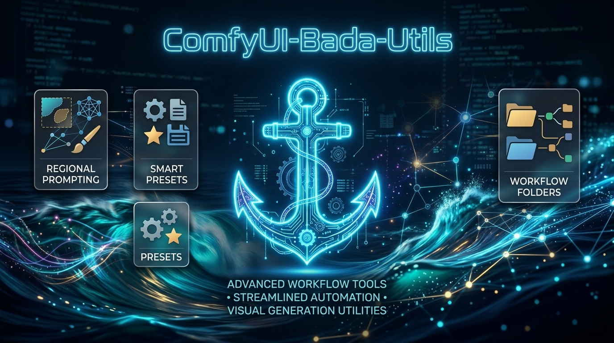
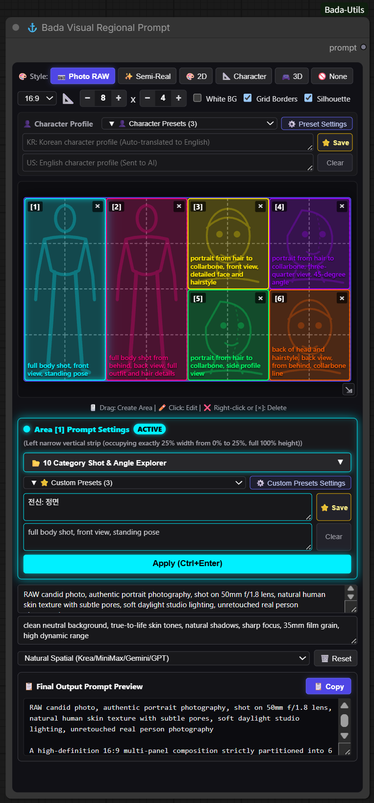
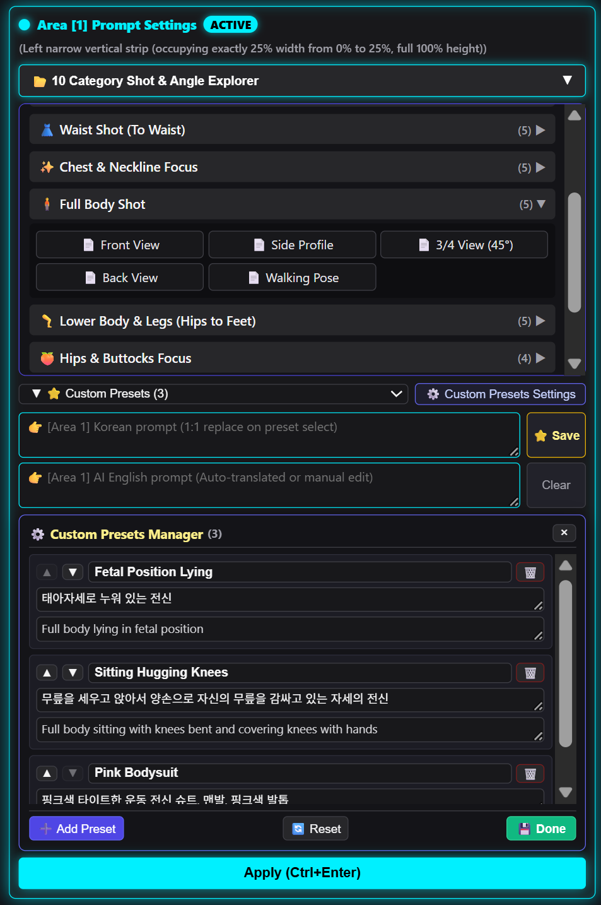
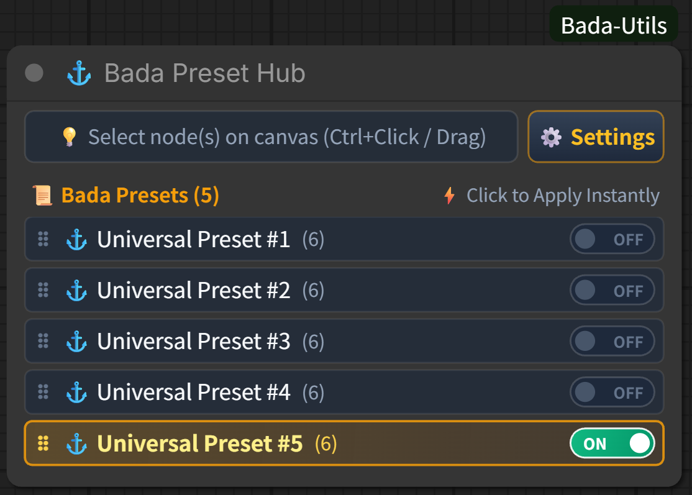
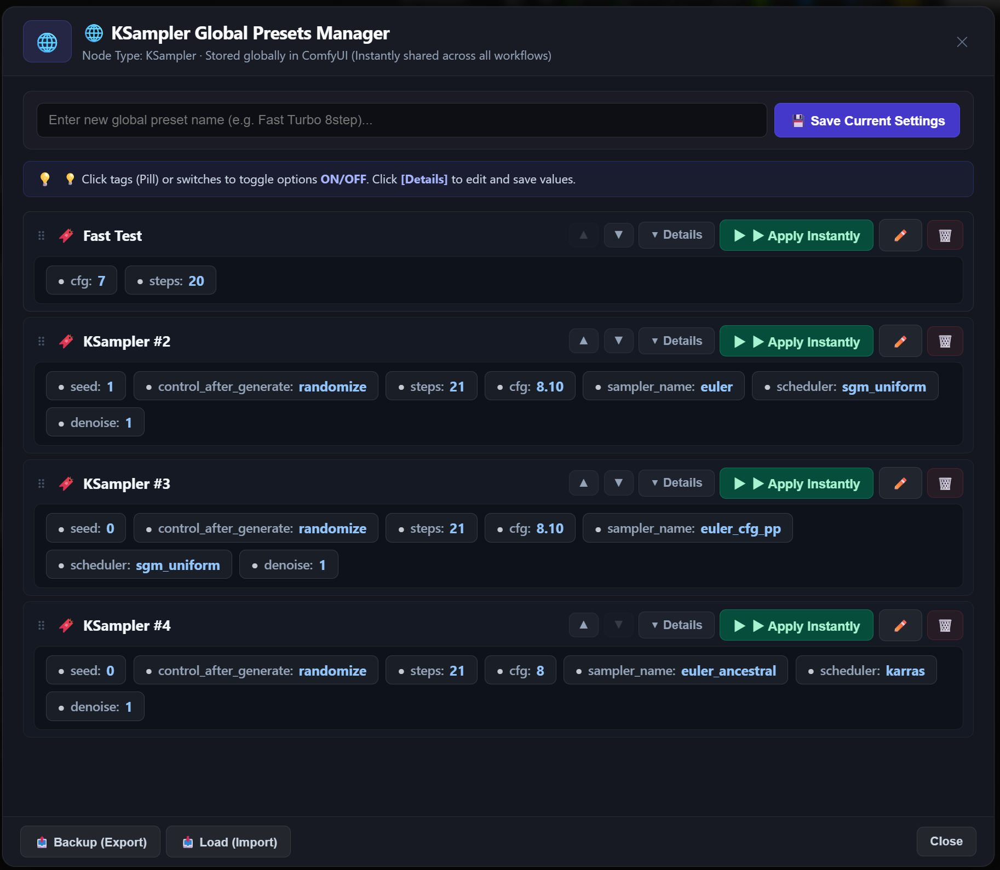
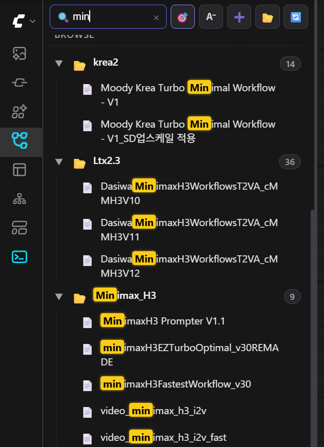
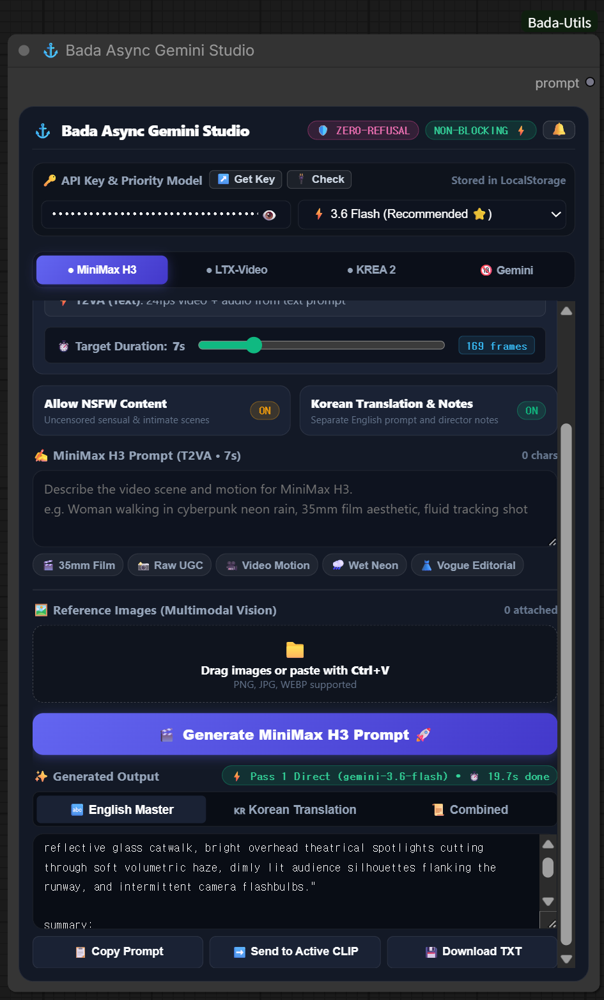
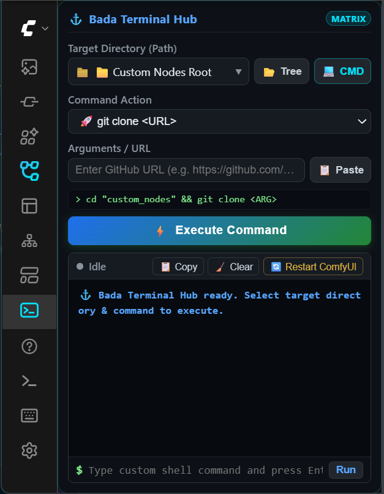
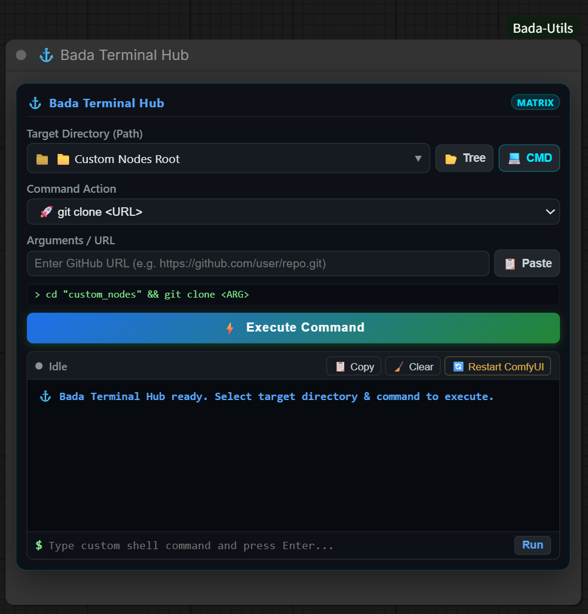
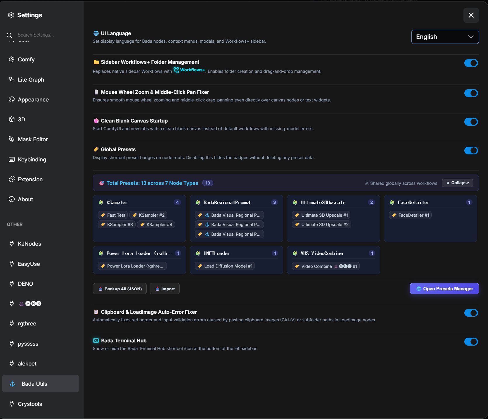

# 🌊 ComfyUI-Bada-Utils (Bada Suite)

<div align="center">


[](https://github.com/bada-ya/ComfyUI-Bada-Utils)

### 💡 "A pragmatic collection of utilities crafted to fix small, annoying friction points discovered while building workflows in ComfyUI every single day."

[English Documentation](#-8-flagship-tools-overview) •
[🇰🇷 한국어 설명서 보기 (README_ko.md)](README_ko.md) •
[⚙️ Settings & i18n](#-bada-unified-settings) •
[🚀 Installation](#-installation)

</div>

<p align="center">
  
</p>

---

## 🧭 8 Flagship Tools Overview

For quick evaluation, here is **what each tool does and when to use it**.  
Click **[📖 Detailed Guide & Settings]** on any item to expand in-depth instructions, visual guides, and screenshots.

```
⚓ ComfyUI-Bada-Utils (8 Flagship Modules)
├── 1. 📐 Visual Grid Regional Prompt Pro (BadaRegionalPrompt)
├── 2. 🌟 Universal Smart Presets & Master Hub (BadaPresetHub & SmartPresets)
├── 3. 🩺 Node Smart Care (Auto Model Assigner & Missing Node Resolver)
├── 4. 📂 Next-Gen Smart Workflow Manager (Workflows+)
├── 5. ✨ Canvas & Clipboard QoL Master (Canvas & Image QoL)
├── 6. ⚓ Bada Async Gemini Studio (BadaAsyncGeminiStudio)
├── 7. 💻 Bada Terminal Hub (BadaTerminalConsole)
└── 8. 🧩 Classic Manager Quick Launcher & Tooltip Bug Auto-Healer (Dual Manager & Tooltip Healer)
```

---

### 1. 📐 Visual Grid Regional Prompt Pro (`BadaRegionalPrompt`)
- **What it does**: Click and drag across a grid right on your canvas to partition regions and assign 10-category body/shot angles to visually compose complex spatial prompts.
- **When to use it**: When designing character turnaround sheets (full body, macro face, side, rear) with rock-solid consistency, multi-panel comic spreads, or positioning elements precisely.

<details>
<summary><b>📖 Detailed Guide & Settings (Click to expand) ▼</b></summary>

<p align="center">
  
</p>

#### 🌟 Key Features
1. **🖱️ Click & Drag Interactive Area Partitioning**:
   * Click and drag diagonally across grid cells to immediately create neon-highlighted rectangular areas.
   <p align="center">
     
   </p>

2. **📂 10-Category Character Sheet Shot Explorer**:
   * Collapsible tree with real-time keyword search:
     1. **👤 Face & Head (Hair to Collarbone)**: Front, Profile, 3/4 View, High Angle, Low Angle, Back Head
     2. **👁️ Extreme Macro Close-up**: Front, Side, 3/4 View
     3. **👚 Bust Shot**: Front, Profile, 3/4 View, High/Low Angle
     4. **👗 Waist Shot**: Front, Profile, 3/4 View, High/Low Angle
     5. **✨ Chest & Neckline**: Front, Side, 3/4 View, High/Low Angle
     6. **🧍 Full Body Turnaround**: Front, Side, 3/4 View, Back View, Walking Pose
     7. **🦵 Lower Body (Hips to Legs)**: Front, Side, 3/4 View, Back View, Dynamic Pose
     8. **🍑 Hips & Buttocks**: Front Pelvis, Side Hip, Back View, Low Angle
     9. **🖐️ 손 클로즈업 (Hands & Fingers)**: Back of Hand, Palm
     10. **🦶 Feet & Toes**: Barefoot Top, Sole, Front, 3/4, Side
   <p align="center">
     
   </p>

3. **🧍 Vector SVG Silhouette Dynamic Viewer**: Full body, macro face, bust, hands, feet, and seated poses render dynamic SVG silhouettes with automatic 16:9, 9:16, and 1:1 aspect ratio scaling.
4. **🎨 5 Art Styles & White Backdrop Lock**: Hyper-realistic, Semi-realistic, 2D Anime, Concept Art, 3D CG — your `White Backdrop` toggle remains permanently preserved across style changes.
5. **👤 Master Character Profile Anchor**: Global top input bar enforces character facial, hair, and costume consistency across all partitioned panels.
6. **🧩 6 Multi-AI Formats**:
   * **Natural Spatial**: Krea 2, MiniMax, Gemini, GPT-4o, Flux, Midjourney.
   * **ComfyUI / SD BREAK**: `(prompt:1.1) BREAK` syntax.
   * **Structured Tags**: `[Area 1 | LEFT (50% W, 100% H)]`.
   * **Coordinates Bounding Box**: `<area_1 bbox="[0.0, 0.0, 0.5, 1.0]">`.
   * **Comma-Separated List** and **Raw JSON**.

</details>

---

### 2. 🌟 Universal Smart Presets & Master Hub (`BadaPresetHub` & `SmartPresets`)
- **What it does**: Switches entire workflow node parameter configurations (checkpoints, samplers, LoRAs, upscalers) with a single click on an on-canvas slim radio bar without messy wires.
- **When to use it**: When switching between SD1.5, SDXL, and Flux settings on a single canvas in one click, or toggling high-res upscale and detailer branches (Bypass/Mute) instantly.

<details>
<summary><b>📖 Detailed Guide & Settings (Click to expand) ▼</b></summary>

<p align="center">
  
</p>

#### 🌟 Key Features
1. **🔘 On-Canvas 24px Ultra-Slim Radio Switcher**:
   * Instantly switch complete workflow parameter snapshots right on the canvas without opening modal dialogs.
2. **🎯 2 Canvas Selection Modes for Instant Snapshot**:
   * **`Ctrl + Mouse Drag` (Box Area Selection)**: Drag a box around dozens of nodes to capture them all (`🎯 Canvas Selection: N Nodes`).
   * **`Ctrl + Mouse Click` (Multi-Node Point Selection)**: Select only the required nodes (Checkpoints, VAE, KSampler, etc.).
   <p align="center">
     
     
   </p>
3. **🟣 Full Bypass & 🔴 Mute Branch Support**:
   * Effortlessly store and toggle execution states (Active, Bypass, Mute) for upscalers, detailers, and face enhancers across different presets.
4. **📋 Universal Preset Hub Manager**:
   * Review node pill tags, reorder (▲/▼), rename (✏️), and export/import `.json` backup profiles.
   <p align="center">
     
   </p>
5. **🏷️ 2-Tier Roof Badges**:
   * Canvas nodes automatically display `[🌐 N]` (Global Presets count) and `[🌟 N]` (Universal Hub linkage count) badges for 1-click modal popup access.
   <p align="center">
     
   </p>
6. **🌐 Per-Node Global Presets & Parameter ON/OFF Pill Toggles**:
   * Access node-specific global presets via right-click context menu.
   * Disable `seed` (strike-through) to **keep the active seed while injecting steps, cfg, sampler, and scheduler**.
   <p align="center">
     
     
   </p>
7. **🧠 3-Tier Smart Node Matching Engine**:
   * `Tier 1 (Node ID)` ➔ `Tier 2 (Title + Type)` ➔ `Tier 3 (Left-to-Right Canvas Coordinate Mapping)` ensures 100% collision-free preset restoration on third-party workflows.

</details>

---

### 3. 🩺 Node Smart Care & Workflow Doctor (`Node Smart Care`)
- **What it does**: 
  - Unifies **missing custom node recovery** and **model/LoRA auto-assignment** into a single, clean right-click context menu: `🩺 [Bada] Node Smart Care`.
  - Intelligently detects the user's action and automatically routes between 4 specialized scenarios:
    1. **Right-click empty canvas**: Scans the entire workflow and opens a 3-tab modal (`📦 Models & LoRAs`, `🧩 Missing Nodes`, `🌐 All-in-One View`).
    2. **Right-click missing node (red X)**: Runs a 6-tier search across 40,000+ manager mappings to find the GitHub repo, offering 1-click ComfyUI Manager installation and live "Already Installed" card sync.
    3. **Right-click installed model node**: Opens the Windows Explorer-style local folder tree with similarity ranking (%) to auto-mount models/LoRAs and remove red error outlines.
    4. **Right-click missing node with model slots**: Prioritizes custom node installation (Priority 1) so the node can be restored before assigning models.
  - Fixes ComfyUI's core transparency bug where `#fff0` transparent text in `Label (rgthree)` turns into an opaque blinding white rectangle, rendering custom author fonts and styling gracefully on the canvas.
  - Zero canvas clutter: Operates 100% on-demand from the context menu with **no intrusive badges** on your graph.
- **When to use it**: When loading external workflows from Civitai or GitHub that contain uninstalled custom nodes (red X) or missing models/checkpoints, and you want to resolve both in seconds without switching tools.

<details>
<summary><b>📖 Detailed Guide & Settings (Click to expand) ▼</b></summary>

#### 🎯 4-Case Intelligent Context Menu Routing (`🩺 [Bada] Node Smart Care`)

| Scenario | Trigger | Action & Interface |
| :--- | :--- | :--- |
| **Case 1: Workflow-Wide Diagnosis** | Right-click blank canvas | Opens 3-tab Workflow Doctor (`📦 Auto-Assign Models`, `🧩 Missing Nodes`, `🌐 All-in-One View`). |
| **Case 2: Specific Missing Node** | Right-click red 'X' missing node | Focuses solely on finding that missing package with 1-click install card. |
| **Case 3: Specific Model Node** | Right-click installed model/LoRA node | Opens local directory folder tree and similarity matcher for immediate assignment. |
| **Case 4: Missing Node with Model Slots** | Right-click missing node with model inputs | **Priority 1**: Prompts custom node installation first since models cannot attach to missing nodes. |

#### 🌟 Key Features
1. **🧩 3-Tab Workflow Doctor (Scroll-Safe & Responsive)**:
   * Instantly switch between `[📦 Models & LoRAs]`, `[🧩 Missing Nodes]`, and `[🌐 All-in-One View]`.
   * Built-in `scrollTop = 0` guarantees the modal never unexpectedly jumps to the bottom.
2. **🧠 6-Tier High-Speed Repository Matching Engine**:
   * `Tier 1 (Exact Class Type Match)` ➔ `Tier 2 (Namespace Decomposition)` ➔ `Tier 3 (Core Keyword Tokenization)` ➔ `Tier 4 (Package Title Match)` ➔ `Tier 5 (Manager nodename_pattern Regex)` ➔ `Tier 6 (GitHub Stars Popularity Weighted Ranking)`.
   * Features client-side dual-layer fallback querying ComfyUI Manager `/v2/customnode/getmappings` directly.
3. **⚡ 1-Click Direct Installation & Real-Time "Already Installed" Multi-Card Sync**:
   * **1-Click Direct Install**: Executes `git clone` and `pip install -r requirements.txt` in the background with live progress indicators.
   * **Real-Time Sibling Sync**: When installing a package, all other cards in the workflow referencing the same repository automatically update to `[✅ Already Installed (Resolved Together)]` with neon status pills, preventing duplicate installation attempts.
4. **🌲 Windows Explorer-Style Folder Tree Explorer & Fuzzy Matcher**:
   * Browse model directory hierarchies with auto-expand and instant highlighting for currently active model files.
   * Normalizes precision (`fp8`, `bf16`, `fp16`), version (`v1`, `v2`, `turbo`), and punctuation to recommend the best local match sorted by similarity (%).
   * Full support for third-party multi-LoRA stacks (`Power Lora Loader (rgthree)`, `DaSiWa`, `Deno`, `Comfyroll`, `Efficiency Nodes`).
5. **🎨 `Label (rgthree)` Transparency Healer & Graceful Typography**:
   * Intercepts `LGraphNode.prototype` color getters to prevent ComfyUI's modern frontend from forcing `opacity: 0.95` on `#fff0` transparent text.
   * Respects original author font size (e.g. 129px, 37px), alignment, and color for clean, beautiful workflow title rendering.
6. **🚀 Zero-Overhead & Clean Canvas**:
   * Zero permanent canvas badges or polling intervals — lightweight, event-driven, and completely out of your way until called.

</details>

---

### 4. 📂 Next-Gen Smart Workflow Manager (`Workflows+`)
- **What it does**: Preserves 0-item empty folders, enables mouse drag-and-drop workflow folder moving, 1.2s hover auto-expansion, real-time active workflow auto-focusing, 100% two-way native SQLite favorites sync, and 4-tier font/row scaling.
- **When to use it**: When organizing hundreds of workflow files cleanly into folders, when empty folders disappearing is frustrating, or when you need to locate the active open workflow's folder in 1 second.

<details>
<summary><b>📖 Detailed Guide & Settings (Click to expand) ▼</b></summary>

#### 📊 Native Workflows vs Enhanced Workflows+ Comparison
| Feature | 📋 Native Workflows Tab | ✨ Enhanced Workflows+ Tab |
| :--- | :---: | :---: |
| **Native State Preserved** | 100% Native | 1-Click Tab Switch (`Workflows` ↔ `Workflows+`) |
| **Empty Folders (`0` items)** | ❌ Hidden when empty | ⭕ **Preserved with grey item count badge** |
| **Mouse Drag & Drop** | ❌ Not supported | ⭕ **Drag to any folder or Root dynamically** |
| **Hover Auto-Expand** | ❌ Not supported | ⭕ **1.2s hover auto-opens subfolders** |
| **Font & Row Size Control** | ❌ Fixed | ⭕ **4-level size switch (`A⁻` ~ `A⁺⁺`) with persistence** |
| **Active Workflow Tracking** | ❌ Manual search | ⭕ **🎯 Real-time auto-focus & smooth scroll into view** |
| **Favorites (⭐/★)** | ⭕ Basic | ⭕ **100% 2-way live sync with native SQLite DB** |
| **Context Menu** | ❌ Basic | ⭕ **Load / Move to / Favorite / Rename / Delete** |

#### 📸 Feature Highlights
* **(1) ✨ Workflows+ Explorer & 🎛️ Quick Toolbar**:
  <p align="center">
    
  </p>
  * 🔍 **Live Search & Keyword Highlighting**: Typing into the search bar instantly highlights matching text with vibrant yellow tags, allowing you to visually spot target workflows across dozens of folders in seconds.
  * 🎯 **Focus Active Workflow**: Smoothly scrolls to and highlights the currently active workflow in bright green.
  * **`A⁺⁺` Font & Row Scaling**: Left-click cycles through 4 levels (`A⁻` to `A⁺⁺`), right-click opens quick selector.
  * ➕ **New Folder**, 📂 **Expand/Collapse All**, 🔄 **Refresh**.

* **(2) 🖱️ Drag & Drop Folder Moving**:
  * Drag files with mouse ghost badge to `🏠 Root` dropzone or target subfolders.
  * Hovering over a collapsed folder for 1.2s automatically expands it.

* **(3) 🎯 Real-Time Active Workflow Focus & Favorites Sync**:
  <p align="center">
    
  </p>
  * Automatically marks the open workflow with a blue `[• Active]` badge and centers it in the view.
  * 100% two-way synchronized with native ComfyUI SQLite database (`comfyui.db`) and favorites bar.

</details>

---

### 5. ✨ Canvas & Clipboard QoL Master (`Canvas & Image QoL`)
- **What it does**: 
  - 🖼️ **Clipboard (Ctrl+V) & LoadImage Auto-Error Fixer**: Auto-heals red error borders and "Missing Media" validation failures caused by pasting web/clipboard images into `LoadImage` nodes.
  - 🧼 **Clean Blank Canvas Startup**: Completely blocks ComfyUI's annoying startup missing-model error popups ("2 errors found") and starts fresh with a lightweight, clean canvas.
  - 🖱️ **Global Canvas Mouse Pan & Zoom Fixer**: Keeps middle-click panning and wheel zooming smooth and unblocked even over textareas or custom nodes.
- **When to use it**: 
  - When copying images from the web and pressing `Ctrl+V` on `LoadImage` nodes (no more red error outlines!).
  - When you want to eliminate the useless default AuraFlow template and missing-model popups every time you launch ComfyUI.
  - When organizing workflow layouts and preventing wheel zoom or pan freezes over text inputs.

<details>
<summary><b>📖 Detailed Guide & Settings (Click to expand) ▼</b></summary>

#### 🌟 Key Features
* **(1) 🖼️ Clipboard (Ctrl+V) & LoadImage Auto-Error Fixer (`LoadImage Fixer`)**:
  * In native ComfyUI, pasting an image from your clipboard into a `LoadImage` node often triggers red outline validation errors because the frontend fails to recognize `pasted/...` subpaths.
  * Bada Utils automatically intercepts `LoadImage`, `LoadImageMask`, and `LoadImageOutput` combo widgets to register the pasted file path and **immediately clear the red error border (Auto-Heal)**.

* **(2) 🧼 Clean Blank Canvas Startup (`Clean Blank Startup`)**:
  * Completely blocks the annoying **`2 errors found` popup** caused by ComfyUI v1.48+ forcing the uninstalled AuraFlow blueprint template (10 nodes) on startup.
  * Ensures initial launches, new tabs, and closed tabs open to a **clean, lightweight blank canvas** for an uncluttered working environment. (Can be toggled in BADA Settings).

* **(3) 🖱️ Global Canvas Mouse Pan & Zoom Fixer**:
  * Prevents middle-click panning and wheel zooming from freezing over textareas, DOM widgets, or custom nodes.

</details>

---

### 6. ⚓ Bada Async Gemini Studio (`BadaAsyncGeminiStudio`)
- **What it does**: Formulates high-end cinematic video and photorealistic image prompts with 4 dedicated engines (MiniMax H3, LTX-Video, KREA 2, Uncensored Gemini Chat) without VRAM impact or execution blocks, with 1-click CLIP injection.
- **When to use it**: When English prompt phrasing is tedious, when you want automatic multi-cut storyboard division for KREA 2, or when brainstorming freely with zero censorship and directly injecting outputs into canvas CLIP nodes.

<details>
<summary><b>📖 Detailed Guide & Settings (Click to expand) ▼</b></summary>

<p align="center">
  
</p>

#### 🌟 4 Dedicated Engine Tabs
1. **🎬 ● MiniMax H3 (Video + Audio)**:
   * 5 submodes: `Ref2VA` (all-in-one ref), `T2VA` (text), `I2VA` (first frame), `FL2VA` (first-last loop), `L2VA` (last landing)
   * 1~30s (up to 721 frames) target duration slider
2. **🎥 ● LTX-Video 2.5 (DiT Video)**:
   * Combines 6 cinematic elements: Shot, Lighting, Action, Subject, Camera, Sound
   * Supports `LTX 2.5`, `LTX T2V`, `LTX I2V`, `Voice & Audio`, `Camera Master`
3. **🟢 ● KREA 2 (Photorealism)**:
   * **🌐 General**: 6 curated art style chips (35mm Film, Raw Snapshot, Vintage Retro, Digital Art, 3D Render, Cyberpunk)
   * **📜 System Prompt**: 5 verified directive cards (Cinematic Anamorphic, Raw UGC, Octane 3D, 90s Polaroid, Vogue Editorial)
   * **🎞️ Storyboard**: Analyzes scenario and partitions it into 2~15 continuous cuts with individual prompt card views
4. **✨ Uncensored Gemini (Google AI Studio-Direct Chat)**:
   * 100% uncensored open conversation with `BLOCK_NONE` safety overrides
   * 4 specialized Gem personas (Universal, Cinematic Director, Fashion Lookbook, Scenario Writer)
   * Real-time Google Search grounding with live web citations

#### 🌟 Core Pipeline Features
* **🛡️ 3-Pass Zero-Refusal Pipeline**:
  * Pass 1: Direct ➔ Pass 2: Cinematic VFX Override ➔ Pass 3: Artistic Metaphor automatic multi-tier fallback bypasses refusal filters completely.
* **⚡ Independent Asynchronous Execution**:
  * Runs independently on backend REST APIs with Zero VRAM usage and zero ComfyUI queue blockage.
* **➡️ 1-Click Send to Active CLIP**:
  * Injects the generated English prompt directly into the active `CLIPTextEncode` node on your canvas.

</details>

---

### 7. 💻 Bada Terminal Hub (`BadaTerminalConsole`)
- **What it does**: Execute real-time terminal commands (`git pull`, `pip install`, etc.) directly inside the ComfyUI sidebar, search all 37+ installed custom node folders, and launch native Windows CMD console windows with 1 click.
- **When to use it**: When updating custom nodes or installing dependencies without opening separate terminals or copying complex directory paths.

<details>
<summary><b>📖 Detailed Guide & Settings (Click to expand) ▼</b></summary>

#### 🚀 2 Convenient Ways to Use
| 1. Docked Sidebar Console (Left Panel) | 2. On-Canvas Custom Node |
| :---: | :---: |
|  |  |
| *Click the `>_` terminal tab on the left sidebar anytime* | *Spawn `⚓ Bada Terminal Hub` node directly on canvas* |

#### 🌟 Key Features
1. **🖥️ Docked Sidebar Console**:
   * Stays integrated at the bottom of the ComfyUI left sidebar for instant access anytime.
2. **🔍 Searchable Path Combobox**:
   * Filter and locate all 37+ installed custom node folders or ComfyUI root in real time with fuzzy typing.
   * Full keyboard arrow navigation, Enter confirmation, and neon cyan matching highlights.
3. **💻 Native Windows Console Launcher (`[ 💻 CMD ]` Button)**:
   * Launches an independent Windows command prompt (`cmd.exe`) window positioned at the selected directory with 1 click.
4. **⚡ 1-Click Quick Actions**:
   * `Git Status`, `Git Pull Origin Main`, `Pip Install Requirements`, `ComfyUI Restart` readily accessible via dropdown.
5. **⚡ Compatibility Quick Fixes & Interactive Confirmation Dialog**:
   * Dedicated dropdown menu expanding downwards for instant dependency fixes:
     - `🔢 Numpy ≤ 2.4`: Resolves numpy 2.x version conflicts with WAS Node Suite, Nunchaku, and legacy custom nodes.
     - `🎥 Kornia 0.7.3`: Resolves kornia attribute and compatibility errors in LTX-Video custom nodes.
   * Automatically detects your exact ComfyUI virtual environment Python path (`envData.python_executable`), preventing global Python pollution.
   * Displays an interactive cyber confirmation modal asking for user approval with full command inspection before execution.
6. **📡 Real-Time WebSocket Terminal Streaming**:
   * Streams stdout and stderr with full ANSI terminal color parsing live in your browser.

</details>

---

### 8. 🧩 Classic Manager Quick Launcher & Tooltip Bug Auto-Healer (`Dual Manager & Tooltip Healer`)
- **What it does**: 
  - **Dual Manager**: Integrates a `[ 🧩 Manager ]` button directly into the top navigation bar, enabling instantaneous access to the classic ComfyUI Manager V4 popup while keeping the modern `[Extensions]` manager fully functional side-by-side.
  - **PrimeVue Tooltip Auto-Healer**: Automatically intercepts and resolves the persistent `(0, 0)` ghost tooltip bug (`.p-tooltip`) in ComfyUI, guaranteeing a clean canvas.
- **When to use it**: 
  - When you want to use **both** the modern `Extensions` store (searching packages, etc.) and the classic manager (bulk update, channel switcher, restart) side-by-side without compromises.
  - When an empty tooltip bubble gets permanently stuck at the top-left corner `(0, 0)` of your ComfyUI window.

> [!WARNING]
> ### 🚨 [CRITICAL] Want to use BOTH Modern Extensions and Classic Manager?
> **DO NOT add `--enable-manager-legacy-ui` to your ComfyUI startup arguments!**
> 
> * **Why**: When `--enable-manager-legacy-ui` is passed, ComfyUI's core frontend **overrides and replaces the `[ Extensions ]` button** with the legacy manager popup. This prevents you from accessing the modern Extensions manager at all.
> * **Solution**: **Run ComfyUI WITHOUT `--enable-manager-legacy-ui`**. Bada Utils preserves the native `[ Extensions ]` button and adds the independent **`[ 🧩 Manager ]`** button right next to it, giving you true dual-manager coexistence!

<details>
<summary><b>📖 Detailed Guide & Settings (Click to expand) ▼</b></summary>

#### 🌟 Key Features
1. **🧩 Full Dual Manager Coexistence**:
   * Places a clean `[ 🧩 Manager ]` pill button in the top menu bar.
   * Clicking it immediately opens the familiar ComfyUI Manager V4 window (Custom Nodes Manager, Model Manager, Update All, Restart, etc.).
   * Toggle the top button on/off anytime via `BADA Settings`.
2. **🛡️ 100% Automatic Ghost Tooltip Healing (`Tooltip Fixer`)**:
   * In ComfyUI, using `--enable-manager-legacy-ui` or certain extensions causes event capturing in `common.js` that disrupts PrimeVue coordinate calculations, permanently sticking `.p-tooltip` at coordinates `(0, 0)` on the top-left of the screen.
   * Bada Utils' built-in auto-healer intercepts aggressive capturing listeners and continuously ensures tooltips correctly track their parent elements or despawn cleanly.
   * **Even if you do use `--enable-manager-legacy-ui`, Bada Utils completely cures the top-left ghost tooltip bug automatically.**

</details>

---

## ⚙️ BADA Unified Settings (`⚙️ Settings -> 🌊 Bada Utils`)

Open the ComfyUI Settings dialog (**`⚙️ Settings`**) and select the **`🌊 Bada Utils`** tab to access the centralized bilingual control center:

<p align="center">
  
</p>

### 📋 Settings Control Center Overview

| Section | Setting Item | Description |
| :--- | :--- | :--- |
| **1. Language** | **🌐 UI Language** | Switch display language between `English` and `한국어 (Korean)` in real time. |
| **2. Workflows+** | **📁 Sidebar Workflows+ Folder Management** | Enables drag-and-drop workflow folder organization, 0-item folder preservation, and Workflows+ in the left sidebar. |
| **3. Sidebar** | **📐 Compact Sidebar Mode (Icons Only)** | Hides text labels below left sidebar icons to keep the sidebar slim, compact, and icon-centric. |
| **4. Manager** | **🧩 Classic Manager Quick Launcher (Dual Manager)** | Displays the `[ 🧩 Manager ]` button in the top menu bar to open the classic manager alongside the modern manager. |
| **5. Canvas QoL** | **🖱️ Mouse Wheel Zoom & Middle-Click Pan Fixer** | Fixes middle-click panning and wheel zoom freezes even over textareas, DOM widgets, and custom nodes. |
| **6. Startup** | **🧼 Clean Blank Canvas Startup** | Starts ComfyUI and new tabs with a clean blank canvas, completely preventing annoying missing-model startup errors (`2 errors found`). |
| **7. Presets** | **🗃️ Global Presets & Inline Overview Panel** | Display shortcut preset badges on node roofs and provides full-width interactive preset summary across all node types. |
| **8. Image QoL** | **📋 Clipboard & LoadImage Auto-Error Fixer** | Automatically fixes red border and input validation errors caused by pasting clipboard images (`Ctrl+V`) or subfolder paths in LoadImage nodes. |
| **9. Terminal** | **🖥️ Bada Terminal Hub** | Show or hide the Bada Terminal Hub shortcut icon at the bottom of the left sidebar. |
| **10. Node Smart Care** | **🩺 Node Smart Care (Missing Node Resolver & Model Assigner)** | Enables the unified right-click context menu (`🩺 [Bada] Node Smart Care`) and 3-tab workflow diagnosis modal for missing custom nodes and models. |

---

> [!NOTE]
> **💡 Recommended ComfyUI Canvas Mode**:  
> Like `rgthree-comfy` and other advanced visual canvas suites, **Classic Canvas Rendering (Nodes 1.0)** is recommended for the best interactive experience.  
> If you have experimental **Nodes 2.0** enabled in ComfyUI Settings (`⚙️ -> Use New Nodes 2.0`), please set it to **Disabled (OFF)** for full interactive grid dragging and on-canvas radio buttons.

---

## 📂 Included Example Workflow

Drag and drop [`workflows/bada_utils_workflow.json`](workflows/bada_utils_workflow.json) directly onto your ComfyUI canvas to immediately test the full ComfyUI-Bada-Utils all-in-one flagship suite (`BadaPresetHub`, `BadaTerminalHub`, `BadaRegionalPrompt`, and `BadaAsyncGeminiStudio`).

---

## 🚀 Installation

### Method 1: 1-Click Symlink Installer (Windows Recommended)
Double-click **`install_junction.bat`** in the repository root to automatically link `ComfyUI-Bada-Utils` into your `ComfyUI/custom_nodes/` directory.

### Method 2: ComfyUI Manager
1. Open ComfyUI Manager.
2. Search for `ComfyUI-Bada-Utils` and click **Install**.
3. Restart ComfyUI and press **`Ctrl + F5` (Hard Refresh)** in your browser.

### Method 3: Git Clone
```bash
cd ComfyUI/custom_nodes
git clone https://github.com/bada-ya/ComfyUI-Bada-Utils.git
```

---

## 🛡️ 100% Backward Compatibility
All existing workflows built with `UniversalPresetHub`, `VisualGridPromptNode`, or `VisualGridPrompt` load seamlessly with zero missing node errors thanks to built-in class alias resolution.

---

## 📄 License
This project is open-sourced under the **[MIT License](LICENSE)**.
