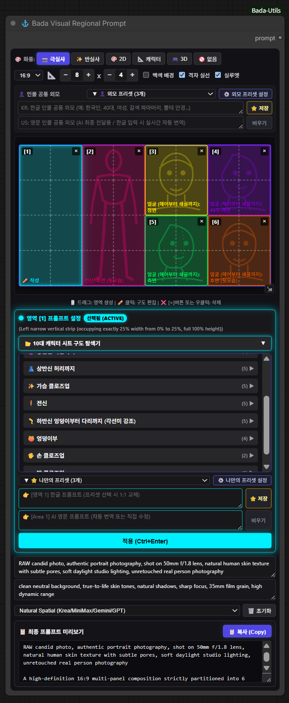
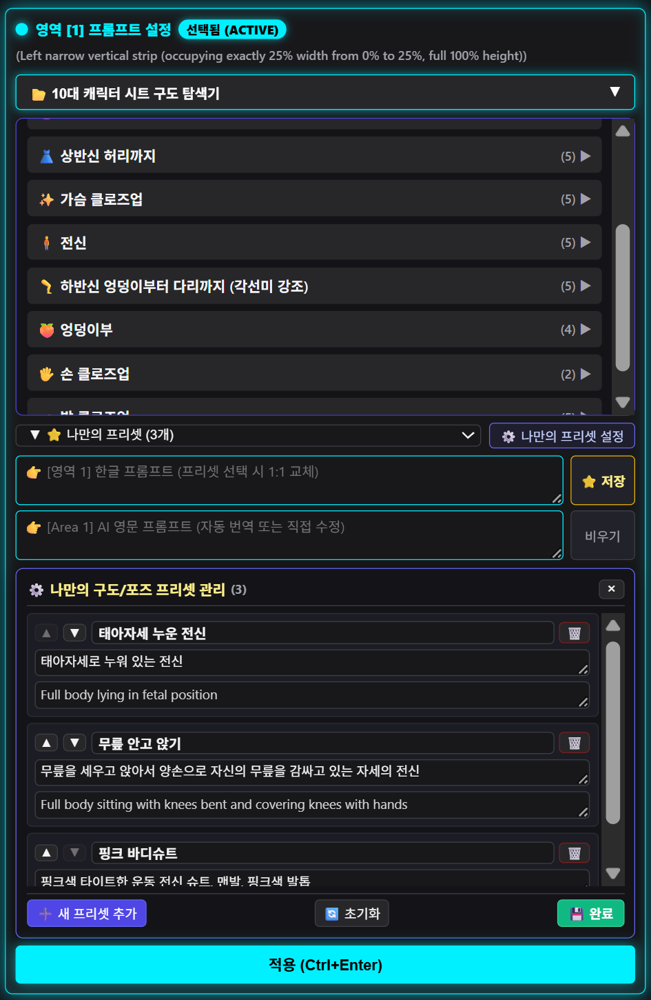
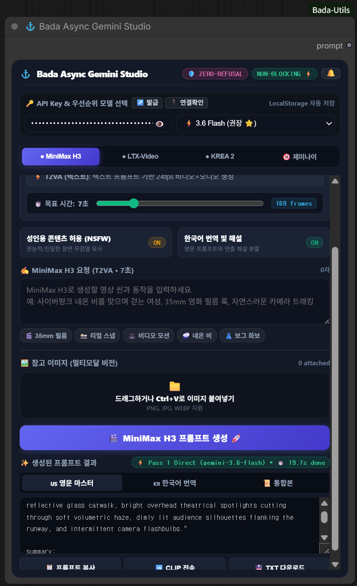
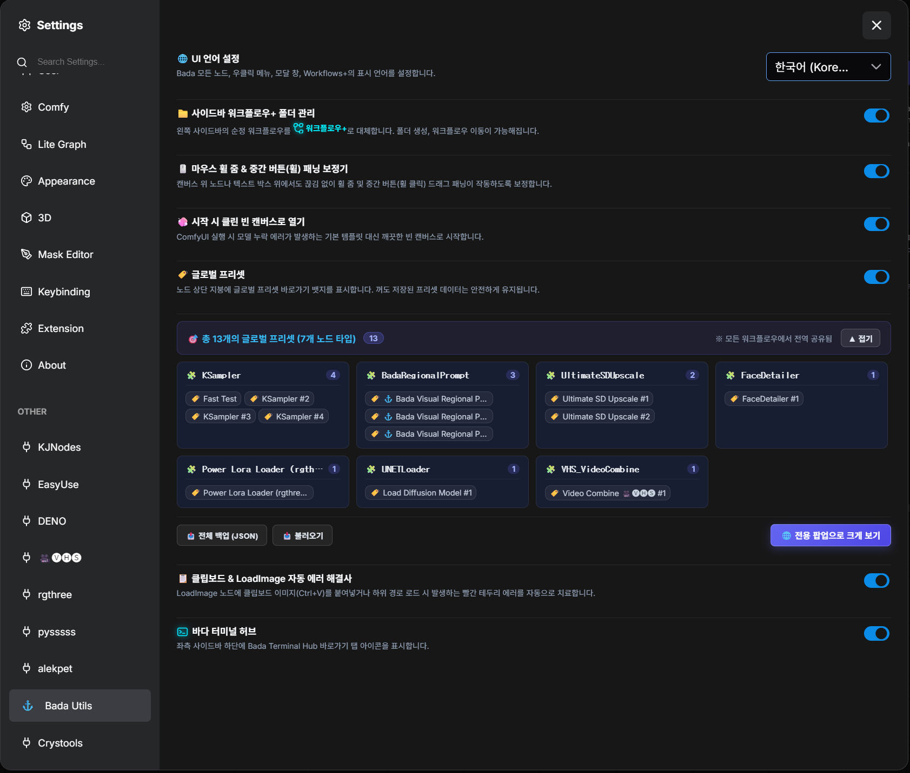

# 🌊 ComfyUI-Bada-Utils (바다 유틸 종합 올인원 스위트)

<div align="center">


[](https://github.com/bada-ya/ComfyUI-Bada-Utils)

### 💡 "ComfyUI를 매일 사용하면서 느꼈던 소소하지만 답답했던 불편점들을 하나씩 직접 고치고 다듬어 만든 실전 유틸리티 모음집입니다."

[🇺🇸 English Documentation (README.md)](README.md) •
[🛠️ 8대 핵심 도구 요약](#-8대-핵심-도구-목록) •
[⚙️ 환경 설정](#-bada-전역-통합-설정) •
[🚀 설치 방법](#-설치-방법-installation)

</div>

---

## 🧭 8대 핵심 도구 목록

바쁜 사용자를 위해 **각 도구가 무슨 일을 하고, 언제 쓰면 편한지** 핵심만 간략히 정리했습니다.  
자세한 사용법과 설정은 각 항목의 **[📖 자세한 설명 및 설정 방법]**을 누르시면 아래로 펼쳐집니다.

```
⚓ ComfyUI-Bada-Utils (8 Flagship Modules)
├── 1. 📐 비주얼 그리드 리저널 프롬프트 (BadaRegionalPrompt)
├── 2. 🌟 유니버셜 스마트 프리셋 허브 (BadaPresetHub & SmartPresets)
├── 3. ⚡ 자동 모델 & LoRA 어사이너 (Auto Assigner)
├── 4. 📂 차세대 스마트 워크플로우 매니저 (Workflows+)
├── 5. ✨ 캔버스 & 클립보드 편의성(QoL) 해결사 (Canvas & Image QoL)
├── 6. ⚓ 비동기 제미나이 스튜디오 (BadaAsyncGeminiStudio)
├── 7. 💻 바다 터미널 허브 (BadaTerminalConsole)
└── 8. 🧩 클래식 매니저 퀵 런처 & 툴팁 버그 자동 치료기 (Dual Manager & Tooltip Healer)
```

---

### 1. 📐 비주얼 그리드 리저널 프롬프트 (`BadaRegionalPrompt`)
- **무슨 기능인가요?**: 캔버스 위에서 격자를 마우스로 쓱 드래그해 영역을 나누고, 10가지 신체 부위 및 카메라 앵글 샷을 지정하여 복잡한 다분할 공간 구도 프롬프트를 시각적으로 생성합니다.
- **이럴 때 쓰면 편합니다**: 캐릭터 시트(전신, 반신, 얼굴 클로즈업, 뒷모습 등)를 일관성 있게 한 번에 뽑거나, 만화 컷 분할 및 배경/인물의 정확한 배치가 필요할 때 유용합니다.

<details>
<summary><b>📖 자세한 설명 및 설정 방법 (클릭하여 펼치기) ▼</b></summary>

<p align="center">
  
</p>

#### 🌟 핵심 세부 기능
1. **🖱️ 마우스 클릭 & 드래그 영역 분할**:
   * 빈 격자 칸에서 마우스 좌클릭 후 대각선으로 드래그하면 원하는 크기의 사각형 영역(Area)이 네온 하이라이트와 함께 즉시 생성됩니다.
   <p align="center">
     
   </p>

2. **📂 윈도우 탐색기형 10대 캐릭터 시트 샷 트리**:
   * 클릭 시 세부 하위 샷이 부드럽게 펼쳐지며 실시간 키워드 검색을 지원합니다:
     1. **👤 얼굴 (헤어~쇄골)**: 정면, 측면, 45도, 하이앵글, 로우앵글, 후면
     2. **👁️ 얼굴 초근접 (Extreme Macro Close-up)**: 정면, 측면, 45도
     3. **👚 상반신 가슴까지 (Bust Shot)**: 정면, 측면, 45도, 하이/로우앵글
     4. **👗 상반신 허리까지 (Waist Shot)**: 정면, 측면, 45도, 하이/로우앵글
     5. **✨ 가슴 클로즈업 (Chest & Neckline)**: 정면, 측면, 45도, 하이/로우앵글
     6. **🧍 전신 (Full Body Turnaround)**: 정면, 측면, 45도, 후면, 자연스러운 워킹 포즈
     7. **🦵 하반신 (골반~각선미)**: 정면, 측면, 45도, 후면, 매혹적인 포즈
     8. **🍑 엉덩이부 (Hips & Buttocks)**: 골반 정면, 엉덩이 측면, 뒷태, 로우앵글
     9. **🖐️ 손 클로즈업 (Hands & Fingers)**: 손등, 손바닥
     10. **🦶 발 클로즈업 (Feet & Toes)**: 발등(맨발), 발바닥, 정면, 45도, 측면
   <p align="center">
     
   </p>

3. **🧍 정밀 벡터 SVG 실루엣 뷰어**: 전신, 얼굴, 상반신, 손, 발 등에 맞춰 캔버스 내부에 벡터 실루엣이 동적 렌더링되며, 16:9, 9:16, 1:1 종횡비에 맞춰 자동 스케일링됩니다.
4. **🎨 5대 화풍 & 백색 배경(White Backdrop) 고정**: 극실사, 반실사, 2D 애니, 설정화, 3D CG 변경 시에도 백색 배경 토글 상태가 완벽히 유지됩니다.
5. **👤 마스터 인물 프로필 앵커**: 상단 공통 프로필 입력창을 통해 모든 분할 패널에 걸쳐 동일 인물의 외모, 헤어, 의상 일관성을 단단하게 고정합니다.
6. **🧩 6종 다중 AI 포맷 출력**:
   * **Natural Spatial**: Krea 2, MiniMax, Gemini, GPT-4o, Flux, Midjourney 최적화.
   * **ComfyUI / SD BREAK**: `(prompt:1.1) BREAK` 문법 자동 분할.
   * **Structured Tags**: `[Area 1 | LEFT (50% W, 100% H)]` 태그.
   * **Coordinates Bounding Box**: `<area_1 bbox="[0.0, 0.0, 0.5, 1.0]">` 형식.
   * **Comma-Separated List** 및 **Raw JSON** 완벽 지원.

</details>

---

### 2. 🌟 유니버셜 스마트 프리셋 허브 (`BadaPresetHub` & `SmartPresets`)
- **무슨 기능인가요?**: 복잡한 선(Wire) 연결 없이, 캔버스 위의 슬림한 라디오 버튼 클릭 한 번으로 전체 워크플로우의 노드 파라미터(체크포인트, 샘플러, LoRA, 스케일러 등)를 통째로 전환합니다.
- **이럴 때 쓰면 편합니다**: 한 캔버스에서 SD1.5 / SDXL / Flux 설정을 원클릭으로 스위칭하거나, 고해상도 업스케일러/디테일러 구간을 원클릭으로 켜고 끄고(Bypass/Mute) 싶을 때 극도로 편합니다.

<details>
<summary><b>📖 자세한 설명 및 설정 방법 (클릭하여 펼치기) ▼</b></summary>

<p align="center">
  
</p>

#### 🌟 핵심 세부 기능
1. **🔘 온캔버스 24px 초슬림 라디오 스위처**:
   * 번거로운 팝업창 없이 캔버스 노드 본체에서 라디오 버튼 클릭 한 번으로 전체 워크플로우 파라미터를 즉시 전환합니다.
2. **🎯 캔버스 노드 일괄 스냅샷 선택 (2가지 모드)**:
   * **`Ctrl + 마우스 드래그` (영역 일괄 선택)**: 수많은 노드를 사각형 박스로 한 번에 드래그하여 스냅샷 저장 (`🎯 캔버스 선택 감지: N개 노드`).
   * **`Ctrl + 마우스 클릭` (개별 다중 선택)**: 필요한 핵심 노드(체크포인트, VAE, KSampler 등)만 콕콕 집어 선택.
   <p align="center">
     
     
   </p>
3. **🟣 바이패스(Bypass) & 🔴 뮤트(Mute) 상태 완벽 지원**:
   * 고화질 업스케일러, 디테일러, 페이스 복원 서브네트워크의 활성/바이패스 분기 상태를 프리셋별로 독립 저장합니다.
4. **📋 유니버셜 프리셋 허브 관리자**:
   * 각 프리셋의 노드 요약 태그, 순서 변경(▲/▼), 이름 변경(✏️), 백업 추출/불러오기 지원.
   <p align="center">
     
   </p>
5. **🏷️ 2-Tier 지붕 뱃지 (Roof Badges)**:
   * 캔버스의 모든 노드 상단에 `[🌐 N]`(글로벌 프리셋 개수) 및 `[🌟 N]`(유니버셜 연동 개수) 뱃지가 마운트되어 클릭 시 전용 팝업이 열립니다.
   <p align="center">
     
   </p>
6. **🌐 개별 노드 글로벌 프리셋 & 파라미터별 ON/OFF 알약 토글**:
   * 노드 우클릭 메뉴를 통해 해당 노드 종류(KSampler 등) 전용 글로벌 프리셋을 관리합니다.
   * `seed`만 OFF(취소선)하여 **시드 번호는 유지한 채 steps, cfg, sampler만 주입**할 수 있습니다.
   <p align="center">
     
     
   </p>
7. **🧠 3단계 스마트 노드 매칭 엔진**:
   * `Tier 1 (Node ID)` ➔ `Tier 2 (Title + Type)` ➔ `Tier 3 (캔버스 X/Y 좌표)` 순으로 추적하여 타인의 워크플로우에서도 충돌 없이 100% 안전하게 복원합니다.

</details>

---

### 3. ⚡ 자동 모델 & LoRA 어사이너 (`Auto Assigner`)
- **무슨 기능인가요?**: 외부 워크플로우를 열었을 때 빨간색 에러로 누락된 모델들을 내 PC에 있는 모델 파일과 이름 유사도(%)를 계산해 원클릭으로 자동 연결해 줍니다.
- **이럴 때 쓰면 편합니다**: 모델 버전(`fp8`, `v2` 등)이나 경로가 살짝 달라 빨갛게 멈췄을 때, 노드를 일일이 찾아다니지 않고 캔버스 우클릭 한 번으로 1초 만에 오류를 해결하고 싶을 때 사용합니다.

<details>
<summary><b>📖 자세한 설명 및 설정 방법 (클릭하여 펼치기) ▼</b></summary>

| 1. 캔버스 빈 곳 우클릭 (전체 모델 일괄 매칭) | 2. 전체 모델 일괄 스마트 매칭 창 |
| :---: | :---: |
|  |  |
| *메뉴 최하단 `⚡ 전체 모델/LoRA 자동 장착` 클릭* | *모든 누락 노드를 감지하여 100% 매칭 및 유사도 순 추천 제공* |

| 3. 특정 노드 우클릭 (단일 노드 매칭) | 4. 해당 노드 단독 스마트 매칭 창 |
| :---: | :---: |
|  |  |
| *메뉴 최하단 `⚡ 이 노드 모델 자동 장착` 클릭* | *선택한 노드 1개만 단독으로 신속하게 매칭/교체* |

#### 🌟 핵심 세부 기능
1. **🌲 윈도우 탐색기형 대형 폴더 트리**:
   * 모델 디렉토리 계층 구조를 시원하게 탐색할 수 있으며, 현재 파일이 있는 폴더를 자동으로 펼쳐 중앙에 하이라이트합니다.
2. **🧩 서드파티 멀티 LoRA 노드 완벽 지원 (Universal Slot Adapter)**:
   * `Power Lora Loader (rgthree)`, `DaSiWa LoRA Loader`, `Deno Multi LoRA Loader`, `Comfyroll`, `Efficiency Nodes` 등 객체형/배열형 멀티 모델 노드도 슬롯별로 완벽 감지합니다.
3. **🧠 지능형 퍼지 매칭 엔진**:
   * 정밀도(`fp8`, `bf16`, `fp16`), 버전(`v1`, `v2`, `turbo`), 특수문자를 정규화하여 가장 적합한 로컬 모델을 유사도(%) 순으로 정렬 추천합니다.
4. **🌐 AI 모델 원클릭 스마트 웹 검색**:
   * 파일명의 군더더기를 정제하여 `🔍 구글 검색`, `🤗 HuggingFace`, `💖 Civitai` 원클릭 다운로드 링크를 제공합니다.
5. **🛡️ 빨간색 에러 테두리 자동 제거**:
   * 모델을 연결하는 즉시 노드 주변의 빨간 에러 테두리를 지우고 캔버스를 정상 리프레시합니다.

</details>

---

### 4. 📂 차세대 스마트 워크플로우 매니저 (`Workflows+`)
- **무슨 기능인가요?**: 빈 폴더(`0`개) 보존, 마우스 드래그 앤 드롭 폴더 이동, 1.2초 호버 자동 열림, 작업 중인 워크플로우 실시간 자동 추적/포커싱, 순정 SQLite DB 즐겨찾기 양방향 동기화 및 4단계 글자 크기 조절을 완벽 지원하는 차세대 사이드바 탐색기입니다.
- **이럴 때 쓰면 편합니다**: 수백 개의 워크플로우 파일을 폴더별로 깔끔하게 정리하고 싶을 때, 빈 폴더가 사라져 답답했을 때, 지금 캔버스에 열려 있는 워크플로우가 어느 폴더에 있는지 1초 만에 찾고 싶을 때 사용합니다.

<details>
<summary><b>📖 자세한 설명 및 설정 방법 (클릭하여 펼치기) ▼</b></summary>

#### 📊 순정 Workflows vs 강화된 Workflows+ 비교
| 구분 | 📋 순정 Workflows 탭 | ✨ 강화된 Workflows+ 탭 |
| :--- | :---: | :---: |
| **순정 환경 보존** | 100% 순정 상태 유지 | 원클릭 상단 탭 전환 (`Workflows` ↔ `Workflows+`) |
| **빈 폴더 표시 (`0`개)** | ❌ 워크플로우 없으면 숨겨짐 | ⭕ **회색 뱃지와 함께 온전히 표시 & 보존** |
| **마우스 드래그 앤 드롭** | ❌ 지원 안 됨 | ⭕ **마우스로 집어서 폴더 / Root로 자유롭게 이동** |
| **폴더 자동 펼침 (호버)** | ❌ 지원 안 됨 | ⭕ **1.2초간 머무르면 하위 폴더 자동 오픈** |
| **글자 & 행 크기 조절** | ❌ 변경 불가 | ⭕ **독립 4단계 조절 (`A⁻` ~ `A⁺⁺`) & 영구 기억** |
| **현재 작업 워크플로우 추적** | ❌ 수동 검색 필요 | ⭕ **🎯 실시간 자동 포커싱 & 스마트 자동 스크롤** |
| **즐겨찾기 (⭐/★)** | ⭕ 기본 제공 | ⭕ **순정 DB와 1:1 양방향 실시간 완벽 동기화** |
| **우클릭 관리 메뉴** | ❌ 기본 메뉴만 제공 | ⭕ **불러오기 / 폴더이동 / 즐겨찾기 / 이름변경 / 삭제** |

#### 📸 주요 화면 가이드
* **(1) ✨ Workflows+ 탐색기 & 🎛️ 상단 원터치 퀵 툴바**:
  <p align="center">
    
  </p>
  * 🔍 **실시간 검색 & 키워드 하이라이트**: 검색창에 단어 입력 시 일치하는 키워드를 눈에 띄는 노란색 뱃지로 실시간 강조 표시하여 수많은 파일 중 원하는 워크플로우를 1초 만에 시각적으로 탐색.
  * 🎯 **작업 중 워크플로우 포커스**: 열려 있는 워크플로우의 위치로 즉시 스크롤하고 초록색 하이라이트로 반짝여 표시.
  * **`A⁺⁺` 글자/행 크기 조절**: 좌클릭 순환 변경 (`A⁻` ~ `A⁺⁺`), 우클릭 즉시 선택 메뉴.
  * ➕ **새 폴더 생성**, 📂 **모두 펼치기/접기**, 🔄 **새로고침**.

* **(2) 🖱️ 마우스 드래그 앤 드롭 폴더 이동**:
  * 마우스 고스트 배지와 함께 최상위 `🏠 Root` 박스 또는 하위 폴더로 드래그하여 이동.
  * 닫힌 폴더 위에 1.2초간 머무르면 폴더가 자동으로 펼쳐집니다.

* **(3) 🎯 작업 중 자동 포커싱 & 순정 DB 즐겨찾기 양방향 동기화**:
  <p align="center">
    
  </p>
  * 상단 탭 전환 시 작업 중인 파일에 파란색 `[• 작업중]` 배지가 붙으며 위치 자동 스크롤.
  * 순정 SQLite DB(`comfyui.db`)와 즐겨찾기 상태가 100% 실시간 연동.

</details>

---

### 5. ✨ 캔버스 & 클립보드 편의성(QoL) 해결사 (`Canvas & Image QoL`)
- **무슨 기능인가요?**: 
  - 🖼️ **클립보드(Ctrl+V) & 로드 이미지 에러 자동 치료 (LoadImage Fixer)**: 웹이나 캡처 이미지를 `LoadImage` 노드에 `Ctrl+V`로 붙여넣었을 때 발생하는 빨간 에러 테두리와 파일 결손(Missing Media) 오류를 실시간 자동 해결.
  - 🧼 **기본 템플릿 에러창 차단 & 클린 빈 캔버스 시작 (Clean Blank Startup)**: ComfyUI 실행 시 내 컴퓨터에 없는 모델로 에러 팝업을 띄우는 기본 워크플로우를 완벽 차단하고 가볍고 깨끗한 빈 화면으로 시작.
  - 🖱️ **전역 마우스 패닝 & 휠 줌 보정기**: 텍스트 입력창이나 서드파티 노드 위에서도 마우스 휠 줌/팬이 멈추지 않도록 스무스하게 보정.
- **이럴 때 쓰면 편합니다**: 
  - 웹 이미지를 캡처해서 `LoadImage` 노드에 `Ctrl+V`로 바로바로 붙여넣으며 작업할 때 (더 이상 빨간 에러 테두리가 뜨지 않습니다!)
  - ComfyUI 켤 때마다 매번 모델 없다고 뜨는 쓸데없는 기본 템플릿과 에러 팝업창을 완전히 없애고 싶을 때
  - 텍스트창 위에서도 마우스 줌/패닝이 멈추지 않고 부드럽게 화면을 이동하고 싶을 때

<details>
<summary><b>📖 자세한 설명 및 설정 방법 (클릭하여 펼치기) ▼</b></summary>

#### 🌟 핵심 세부 기능
* **(1) 🖼️ 클립보드(Ctrl+V) & 로드 이미지 에러 자동 치료 (`LoadImage Fixer`)**:
  * ComfyUI에서 웹 브라우저나 캡처 도구의 이미지를 `LoadImage` 노드에 `Ctrl+V`로 붙여넣으면, 프론트엔드 유효성 검사기가 `pasted/...` 하위 경로를 인식하지 못해 빨간 테두리 에러를 띄우는 고질적 버그가 있습니다.
  * Bada Utils는 `LoadImage`, `LoadImageMask`, `LoadImageOutput` 노드의 콤보 위젯을 실시간으로 감지하여, 붙여넣은 이미지의 경로를 안전하게 등록하고 **빨간 에러 테두리를 즉각 제거(Auto-Heal)**합니다.

* **(2) 🧼 기본 템플릿 에러 차단 & 클린 빈 캔버스 시작 (`Clean Blank Startup`)**:
  * ComfyUI 실행 시 내 컴퓨터에 설치되어 있지 않은 기본 AuraFlow 템플릿(10개 노드)이 강제로 열리며 뜨는 불필요한 **`2 errors found` 팝업을 원천 차단**합니다.
  * ComfyUI 최초 실행, 새 탭 오픈, 기존 탭 종료 시 언제나 **가볍고 깨끗한 빈 캔버스**로 기동하여 쾌적하게 작업을 시작할 수 있습니다. (설정에서 켜고 끄기 가능)

* **(3) 🖱️ 전역 마우스 화면 이동(Pan) & 휠 줌(Zoom) 보정**:
  * 텍스트 입력창이나 서드파티 노드 위에서도 마우스 휠 줌 및 중간 버튼 패닝이 멈추지 않고 매끄럽게 동작합니다.

</details>

---

### 6. ⚓ 비동기 제미나이 스튜디오 (`BadaAsyncGeminiStudio`)
- **무슨 기능인가요?**: ComfyUI 이미지 생성 중에도 VRAM 간섭 0%, 브라우저 프리징 없이 100% 독립 비동기로 MiniMax H3, LTX-Video, KREA 2 영상/이미지 프롬프트를 기획하고, 100% 무검열 자유 대화 및 CLIP 원클릭 전송을 지원합니다.
- **이럴 때 쓰면 편합니다**: 긴 시네마틱 프롬프트를 영작하기 귀찮을 때, KREA 2 전용 스타일 지침이나 연속 컷 스토리보드를 자동 분할하고 싶을 때, 무검열 대화로 기획을 다듬고 캔버스의 `CLIPTextEncode` 노드로 곧바로 쏘고 싶을 때 사용합니다.

<details>
<summary><b>📖 자세한 설명 및 설정 방법 (클릭하여 펼치기) ▼</b></summary>

<p align="center">
  
</p>

#### 🌟 4대 독립 전용 엔진 구성
1. **🎬 ● MiniMax H3 (비디오 + 오디오)**:
   * 5대 세부 모드: `Ref2VA` (전체 참조), `T2VA` (텍스트), `I2VA` (첫 프레임), `FL2VA` (첫-끝 루프), `L2VA` (끝 착륙)
   * 1~30초 (최대 721 frames) 목표 시간 슬라이더 연동
2. **🎥 ● LTX-Video 2.5 (DiT 비디오)**:
   * 샷, 조명, 액션, 인물, 카메라, 사운드 6대 요소 결합 프롬프트 생성
   * `LTX 2.5`, `LTX T2V`, `LTX I2V`, `Voice & Audio`, `Camera Master` 서브모드 지원
3. **🟢 ● KREA 2 (포토리얼리즘)**:
   * **🌐 일반**: 35mm 필름, Raw 스냅샷, 빈티지 레트로, 디지털 아트, 3D 렌더링, 사이버펑크 6대 화풍 칩
   * **📜 시스템 프롬프트**: 5대 엄선 지침 카드(시네마틱 35mm, 스마트폰 Raw UGC, 옥테인 3D, 90s 폴라로이드, 보그 화보)
   * **🎞️ 스토리보드**: 상황을 분석하여 2~15컷 연속 시퀀스를 자동 분할하고 각 컷별 영문/한글 카드뷰 생성
4. **✨ 무검열 제미나이 (Google AI Studio식 자유 대화)**:
   * 5대 안전 카테고리 완전 해제 (`BLOCK_NONE`) 기반 100% 무검열 자유 대화
   * 4대 Gem 페르소나 (만능, 시네마틱 디렉터, 하이패션 룩북, 심층 시나리오)
   * Google 실시간 웹검색 그라운딩 연동 (최신 정보 및 출처 링크 지원)

#### 🌟 핵심 파이프라인 특징
* **🛡️ 3-Pass 제로 거부 (Zero-Refusal) 엔진**:
  * Pass 1: Direct ➔ Pass 2: Cinematic VFX Override ➔ Pass 3: Artistic Metaphor 다단계 자동 폴백으로 검열 차단을 원천 우회합니다.
* **⚡ 독립 비동기 백엔드 실행**:
  * ComfyUI의 모델 로딩 및 VRAM 점유에 전혀 영향을 주지 않는 백그라운드 REST 통신으로 동작합니다.
* **➡️ 원클릭 Active CLIP 전송**:
  * 생성된 프롬프트나 대화 결과물을 캔버스에서 선택된 `CLIPTextEncode` 노드로 원클릭 다이렉트 주입합니다.

</details>

---

### 7. 💻 바다 터미널 허브 (`BadaTerminalConsole`)
- **무슨 기능인가요?**: ComfyUI 화면을 벗어나지 않고 사이드바에서 실시간 터미널 명령(`git pull`, `pip install` 등)을 실행하고, 내 커스텀 노드 목록을 검색해 곧바로 독립 Windows CMD 창을 띄웁니다.
- **이럴 때 쓰면 편합니다**: 노드 업데이트나 종속 라이브러리 설치를 위해 매번 CMD 창을 열고 `cd ...` 경로를 복사-붙여넣기 하던 번거로움을 완전히 없애고 싶을 때 사용합니다.

<details>
<summary><b>📖 자세한 설명 및 설정 방법 (클릭하여 펼치기) ▼</b></summary>

#### 🚀 2가지 편리한 실행 방식
| 1. 좌측 사이드바 툴바 고정 콘솔 | 2. 캔버스 독립 커스텀 노드 |
| :---: | :---: |
|  |  |
| *좌측 사이드바 툴바에서 `>_` 단추를 눌러 즉시 호출* | *캔버스에 `⚓ Bada Terminal Hub` 노드를 꺼내어 작업* |

#### 🌟 핵심 세부 기능
1. **🖥️ 사이드바 툴바 고정 콘솔**:
   * ComfyUI 왼쪽 사이드 툴바 최하단에 상시 상주하여 작업 흐름을 끊지 않고 언제든 즉시 호출할 수 있습니다.
2. **🔍 실시간 검색 디렉토리 콤보박스 (Searchable Path Combobox)**:
   * 내 PC에 설치된 37개 이상의 커스텀 노드와 ComfyUI 루트 디렉토리를 알파벳/한글 타이핑 즉시 실시간 필터링합니다.
   * 키보드 상/하 화살표 선택, Enter 확정, 네온 시안 하이라이트를 지원합니다.
3. **💻 네이티브 Windows 콘솔 연동 (`[ 💻 CMD ]` 버튼)**:
   * 클릭 한 번으로 선택된 폴더 경로를 `cwd`로 하는 실제 독립된 Windows 명령 프롬프트(`cmd.exe`) 창을 팝업으로 즉시 실행합니다.
4. **⚡ 원클릭 유지보수 액션 (Quick Actions)**:
   * `Git Status`, `Git Pull Origin Main`, `Pip Install Requirements`, `ComfyUI Restart` 등 자주 쓰는 명령어를 드롭다운에서 선택해 원클릭 실행합니다.
5. **📡 실시간 웹소켓 터미널 스트리밍**:
   * 실행 중인 명령어의 표준 출력(stdout/stderr)을 ANSI 컬러 파싱과 함께 실시간으로 감상할 수 있습니다.

</details>

---

### 8. 🧩 클래식 매니저 퀵 런처 & 툴팁 버그 자동 치료기 (`Dual Manager & Tooltip Healer`)
- **무슨 기능인가요?**: 
  - **듀얼 매니저(Dual Manager)**: ComfyUI 상단 툴바에 `[ 🧩 Manager ]` 버튼을 배치하여, 신형 매니저(`Extensions`)를 그대로 유지하면서도 친숙하고 검증된 클래식 ComfyUI Manager 팝업창을 즉시 호출할 수 있습니다.
  - **PrimeVue 툴팁 버그 자동 치료 (Auto-Healer)**: ComfyUI 환경에서 발생하는 화면 좌측 상단 `(0, 0)` 위치의 유령 풍선말 버그를 실시간으로 자동 감지하여 완벽하게 제거 및 위치를 교정합니다.
- **이럴 때 쓰면 편합니다**: 
  - 신형 `Extensions` 탭의 기능(노드 검색 등)과 구형 클래식 매니저의 기능(빠른 업데이트, 채널 변경 등)을 **둘 다 동시에 번갈아가며 자유롭게** 쓰고 싶을 때
  - ComfyUI 화면 좌측 상단에 알 수 없는 빈 풍선말 찌꺼기가 영구적으로 박혀 신경 쓰일 때

> [!WARNING]
> ### 🚨 [필독] 신형 매니저와 클래식 매니저를 동시에 병용(Dual)하고 싶을 때 주의사항
> ComfyUI 시작 인수에 **`--enable-manager-legacy-ui`를 절대로 추가하지 마세요!**
> 
> * **이유**: `--enable-manager-legacy-ui` 인수를 넣고 실행하면, ComfyUI 순정 프론트엔드가 신형 **`[ Extensions ]` 버튼 자체를 구형 레거시 매니저로 강제 교체(덮어쓰기)**해 버립니다. 이렇게 되면 신형 매니저 UI를 열 수 없게 되어 두 매니저를 동시에 쓸 수 없습니다.
> * **해결 방법**: **해당 인수(`--enable-manager-legacy-ui`)를 완전히 제거한 순정 상태로 실행**해 주세요. Bada Utils가 신형 `[ Extensions ]` 버튼을 100% 온전히 보존한 채, 바로 옆에 독립된 **`[ 🧩 Manager ]`** 클래식 매니저 버튼을 띄워 두 매니저를 완벽하게 공존시켜 줍니다.

<details>
<summary><b>📖 자세한 설명 및 설정 방법 (클릭하여 펼치기) ▼</b></summary>

#### 🌟 핵심 세부 기능
1. **🧩 신형 ↔ 구형 매니저 완전 공존 (Dual Manager)**:
   * ComfyUI 상단 메뉴바에 독립된 **`[ 🧩 Manager ]`** 버튼이 생성됩니다.
   * 클릭 시 순정 ComfyUI Manager V4 레거시 인터페이스가 즉시 팝업으로 열려 Custom Nodes Manager, Model Manager, Update All, Restart 등의 기능을 손쉽게 사용할 수 있습니다.
   * `BADA 전역 설정`에서 버튼 표시 여부를 언제든지 켜거나 끌 수 있습니다.
2. **🛡️ 화면 좌측 상단 (0, 0) 유령 풍선말 버그 100% 자동 치료 (`Tooltip Fixer`)**:
   * ComfyUI에서 레거시 매니저 인수(`--enable-manager-legacy-ui`)를 사용하거나 특정 확장 노드를 로드할 경우, `common.js`의 전역 이벤트 간섭으로 인해 PrimeVue 툴팁(`.p-tooltip`)이 화면 좌측 상단 `(0, 0)` 좌표에 고정된 채 사라지지 않는 치명적인 렌더링 버그가 발생합니다.
   * Bada Utils는 백그라운드에서 비정상적인 캡처 리스너를 방어하고, 툴팁이 엉뚱한 위치에 고아(Orphan) 객체로 남는 즉시 좌표를 올바른 부모 요소로 재계산하거나 안전하게 소멸시킵니다.
   * **사용자가 `--enable-manager-legacy-ui` 인수를 켜고 사용하는 환경에서도 유령 풍선말 버그가 100% 완벽히 해결됩니다.**

</details>

---

## ⚙️ BADA 전역 통합 설정 (`⚙️ Settings -> 🌊 Bada Utils`)

ComfyUI 우측 상단 톱니바퀴(**`⚙️ Settings`**) 메뉴에서 **`🌊 Bada Utils`** 탭을 선택하여 모든 편의 기능을 한눈에 제어할 수 있습니다:

<p align="center">
  
</p>

### 📋 통합 설정 제어 센터 안내

| 섹션 | 설정 항목 | 설명 |
| :--- | :--- | :--- |
| **1. 언어 설정** | **🌐 UI 언어 설정** | `English` 및 `한국어 (Korean)` 실시간 전환. ComfyUI 순정 언어 설정과 완전 독립적으로 작동하여 안정적인 언어 환경을 유지합니다. |
| **2. 워크플로우+** | **📁 사이드바 워크플로우+ 폴더 관리** | 왼쪽 사이드바에서 드래그 앤 드롭 폴더 이동, 빈 폴더(0개) 보존, 실시간 작업 파일 포커싱을 지원하는 Workflows+ 기능을 제어합니다. |
| **3. 사이드바** | **📐 사이드바 콤팩트 모드 (아이콘만 표시)** | 좌측 사이드바 버튼 아래의 텍스트 라벨을 숨겨 사이드바를 슬림하고 깔끔하게 아이콘 중심으로 축소합니다. |
| **4. 매니저** | **🧩 클래식 매니저 퀵 런처 (Dual Manager)** | 상단 메뉴바에 구형 클래식 매니저를 즉시 여는 `[ 🧩 Manager ]` 버튼을 띄워 신형 매니저와 동시에 공존시킵니다. |
| **5. 캔버스 편의성** | **🖱️ 마우스 휠 줌 & 중간 버튼(휠) 패닝 보정기** | 텍스트 입력창이나 서드파티 노드 위에서도 마우스 휠 줌 및 중간 버튼 패닝이 멈추지 않고 매끄럽게 동작하도록 보정합니다. |
| **6. 시작 환경** | **🧼 시작 시 클린 빈 캔버스로 열기** | ComfyUI 최초 실행 및 새 탭 오픈 시 기본 모델 누락 오류("2 errors found")를 방지하고 깨끗한 빈 캔버스로 기동하도록 설정합니다. |
| **7. 프리셋 관리** | **🗃️ 글로벌 프리셋 & 인라인 요약 패널** | 노드 상단 지붕에 바로가기 뱃지 표시 및 워크플로우 간 전역 공유되는 노드별 프리셋을 한눈에 파악하고 백업/복원할 수 있는 통합 패널을 제공합니다. |
| **8. 이미지 편의성** | **📋 클립보드 & LoadImage 자동 에러 해결사** | 클립보드 이미지(`Ctrl+V`)를 붙여넣거나 하위 경로 로드 시 발생하는 빨간 테두리 에러를 자동으로 치료합니다. |
| **9. 터미널 허브** | **🖥️ 바다 터미널 허브** | 좌측 사이드바 하단에 Bada Terminal Hub 바로가기 탭 아이콘 표시 여부를 설정합니다. |

---

> [!NOTE]
> **💡 권장 ComfyUI 캔버스 모드**:  
> `rgthree-comfy` 등 고급 비주얼 캔버스 도구들과 마찬가지로, **클래식 캔버스 렌더링(Nodes 1.0)** 모드 사용을 권장합니다.  
> ComfyUI 설정(`⚙️ -> Use New Nodes 2.0`)에서 실험적 **Nodes 2.0**이 켜져 있다면, 부드러운 격자 드래그와 온캔버스 라디오 버튼 사용을 위해 **OFF(비활성화)**로 설정해 주세요.

---

## 📂 기본 제공 예제 워크플로우

저장소의 [`workflows/bada_utils_workflow.json`](workflows/bada_utils_workflow.json) 파일을 ComfyUI 화면으로 **드래그 & 드롭**하시면 ComfyUI-Bada-Utils의 4대 핵심 노드(`BadaPresetHub`, `BadaTerminalHub`, `BadaRegionalPrompt`, `BadaAsyncGeminiStudio`)가 모두 배치된 올인원 통합 워크플로우를 즉시 테스트하실 수 있습니다.

---

## 🚀 설치 방법 (Installation)

### 방법 1. 1-클릭 바로가기 설치 (Windows 권장)
저장소 루트의 **`install_junction.bat`** 파일을 더블 클릭하여 실행하면 ComfyUI의 `custom_nodes/` 폴더에 Junction 바로가기가 자동 생성됩니다.

### 방법 2. ComfyUI Manager
1. ComfyUI Manager를 엽니다.
2. `ComfyUI-Bada-Utils`를 검색한 후 **Install**을 클릭합니다.
3. ComfyUI를 재시작하고 브라우저에서 **`Ctrl + F5` (강력 새로고침)**을 누릅니다.

### 방법 3. Git Clone
```bash
cd ComfyUI/custom_nodes
git clone https://github.com/bada-ya/ComfyUI-Bada-Utils.git
```

---

## 🛡️ 100% 하위 호환성 보장 (Backward Compatibility)
기존에 개별 노드로 제작된 워크플로우(`UniversalPresetHub`, `VisualGridPromptNode`, `VisualGridPrompt`)는 **자동 클래스 별칭(Alias) 매핑**을 통해 빨간색 결손 노드 에러 없이 100% 완벽하게 로드되고 정상 작동합니다.

---

## 📄 라이선스 (License)
본 프로젝트는 **[MIT License](LICENSE)** 에 따라 오픈소스로 배포됩니다.
