# 🌊 ComfyUI-Bada-Utils (바다 유틸 종합 올인원 스위트)

<div align="center">


[](https://github.com/bada-ya/ComfyUI-Bada-Utils)

**ComfyUI 워크플로우 제작 생산성을 극대화하는 올인원 차세대 종합 유틸리티 스위트**  
*파편화되어 있던 4개의 핵심 커스텀 노드를 하나로 완벽 통합한 마스터 패키지*

[🇺🇸 English Documentation (README.md)](README.md) •
[✨ 4대 모듈 개요](#-4대-핵심-통합-모듈-개요) •
[📸 모듈별 상세 가이드](#-모듈별-상세-기능-및-시각적-가이드) •
[⚙️ 환경 설정](#-bada-전역-설정-및-다국어-지원) •
[🚀 설치 방법](#-설치-방법-installation)

</div>

---

## 🌟 4대 핵심 통합 모듈 개요

`ComfyUI-Bada-Utils`는 편의성(QoL), 프리셋 허브, 자동 모델 매칭, 공간 구도 프롬프트 도구를 완벽히 통합하여 워크플로우 개발 및 이미지 생성 속도를 비약적으로 단축시킵니다.

```
🌊 ComfyUI-Bada-Utils
├── 📐 Module 1: 비주얼 그리드 리저널 프롬프트 Pro (Visual Grid Regional Prompt)
│   └── 마우스 드래그 격자 분할, 10대 캐릭터 시트 샷 트리, 벡터 SVG 실루엣, 6종 AI 포맷 출력
├── 🌟 Module 2: 유니버셜 스마트 프리셋 허브 (Universal Smart Presets & Master Hub)
│   └── 24px 초슬림 온캔버스 라디오 스위처, Ctrl+드래그 일괄 스냅샷, 2-Tier 지붕 뱃지, 글로벌 프리셋
├── ⚡ Module 3: 자동 모델 & LoRA 어사이너 (Auto Model & LoRA Assigner)
│   └── 외부 워크플로우 미설치 모델 감지, 지능형 퍼지 매칭(%), 윈도우 탐색기형 대형 폴더 트리
└── ✨ Module 4: 편의성(QoL) 마스터 (Quality of Life Master)
    └── Workflows+ 사이드바 탐색기 (드래그 이동/빈 폴더 보존), 작업 중 자동 포커싱, 클린 빈 캔버스, 마우스 팬/줌 보정
```

---

## 📸 모듈별 상세 기능 및 시각적 가이드

---

### 📐 Module 1. 비주얼 그리드 리저널 프롬프트 Pro (`BadaRegionalPrompt`)
> **시각적 격자 분할 및 멀티 패널 공간 구도 프롬프팅 시스템**  
> (Krea 2, MiniMax, Flux, SD3, ComfyUI BREAK, Midjourney, Imagen 3, ChatGPT, Gemini 완벽 지원)

<p align="center">
  
</p>

#### 🌟 핵심 특징
1. **🖱️ 마우스 클릭 & 드래그 영역 생성**:
   * 빈 격자 칸에서 마우스 좌클릭 후 대각선으로 드래그하면 원하는 크기의 사각형 영역(Area)이 네온 컬러와 함께 즉시 생성됩니다.
   <p align="center">
     
   </p>
2. **📂 윈도우 탐색기형 10대 캐릭터 시트 샷 트리**:
   * 평소에는 대분류만 보이다가 클릭 시 세부 하위 샷이 부드럽게 펼쳐지며 실시간 검색창 필터링을 지원합니다:
     1. **👤 얼굴 (헤어~쇄골)**: 정면, 측면, 45도, 하이앵글, 로우앵글, 후면
     2. **👁️ 얼굴 초근접 (Extreme Macro Close-up)**: 정면, 측면, 45도
     3. **👚 상반신 가슴까지 (Bust Shot)**: 정면, 측면, 45도, 하이/로우앵글
     4. **👗 상반신 허리까지 (Waist Shot)**: 정면, 측면, 45도, 하이/로우앵글
     5. **✨ 가슴 클로즈업 (Chest & Neckline)**: 정면, 측면, 45도, 하이/로우앵글
     6. **🧍 전신 (Full Body Turnaround)**: 정면, 측면, 45도, 후면, 자연스러운 워킹 포즈
     7. **🦵 하반신 (골반~각선미)**: 정면, 측면, 45도, 후면, 매혹적인 포즈
     8. **🍑 엉덩이부 (Hips & Buttocks)**: 골반 정면, 엉덩이 측면, 뒷태, 로우앵글
     9. **🖐️ 손 클로즈업 (Hands & Fingers)**: 손등, 손바닥
     10. **🦶 발 클로즈업 (Feet & Toes)**: 발등(맨발), 발바닥, 정면, 45도, 측면
   <p align="center">
     
   </p>
3. **🧍 정밀 벡터 SVG 실루엣 뷰어**: 전신, 얼굴, 상반신, 손, 발, 착석 포즈 등에 맞춰 캔버스 내부에 벡터 SVG 실루엣이 100% 동적 렌더링되며, 16:9, 9:16, 1:1 종횡비에 맞춰 자동 스케일링됩니다.
4. **🎨 5대 화풍 스타일 & 백색 배경(White Backdrop) 고정**: 극실사, 반실사, 2D 애니, 설정화, 3D CG 변경 시에도 백색 배경 토글 상태가 완벽히 유지됩니다.
5. **👤 마스터 인물 프로필 앵커**: 상단 공통 프로필 입력창을 통해 모든 분할 패널에 걸쳐 동일 인물의 얼굴, 헤어, 의상 일관성을 유지합니다.
6. **🧩 6종 다중 AI 포맷 출력**:
   * **Natural Spatial**: Krea 2, MiniMax, Gemini, GPT-4o, Flux, Midjourney 최적화.
   * **ComfyUI / SD BREAK**: `(prompt:1.1) BREAK` 문법 자동 분할.
   * **Structured Tags**: `[Area 1 | LEFT (50% W, 100% H)]` 태그.
   * **Coordinates Bounding Box**: `<area_1 bbox="[0.0, 0.0, 0.5, 1.0]">` 형식.
   * **Comma-Separated List** 및 **Raw JSON** 완벽 지원.

---

### 🌟 Module 2. 유니버셜 스마트 프리셋 허브 (`BadaPresetHub` & `SmartPresets`)
> **선 연결 없이 단 한 번의 클릭으로 전체 워크플로우 설정을 일괄 제어하는 마스터 컨트롤 타워**

<p align="center">
  
</p>

#### 🌟 핵심 특징
1. **🔘 온캔버스 24px 초슬림 라디오 스위처 (Fast Groups Style)**:
   * 번거로운 설정창을 열지 않고도 캔버스 노드 본체에서 라디오 버튼 클릭 한 번으로 전체 워크플로우 설정을 즉시 전환합니다.
2. **🎯 캔버스 노드 일괄 스냅샷 선택 (2가지 모드)**:
   * **`Ctrl + 마우스 드래그` (영역 일괄 선택)**: 수많은 노드를 사각형 박스로 한 번에 드래그하여 스냅샷 저장 (`🎯 캔버스 선택 감지: 11개 노드`).
   * **`Ctrl + 마우스 클릭` (개별 다중 선택)**: 필요한 핵심 노드(체크포인트, VAE, KSampler 등)만 콕콕 집어 선택.
   <p align="center">
     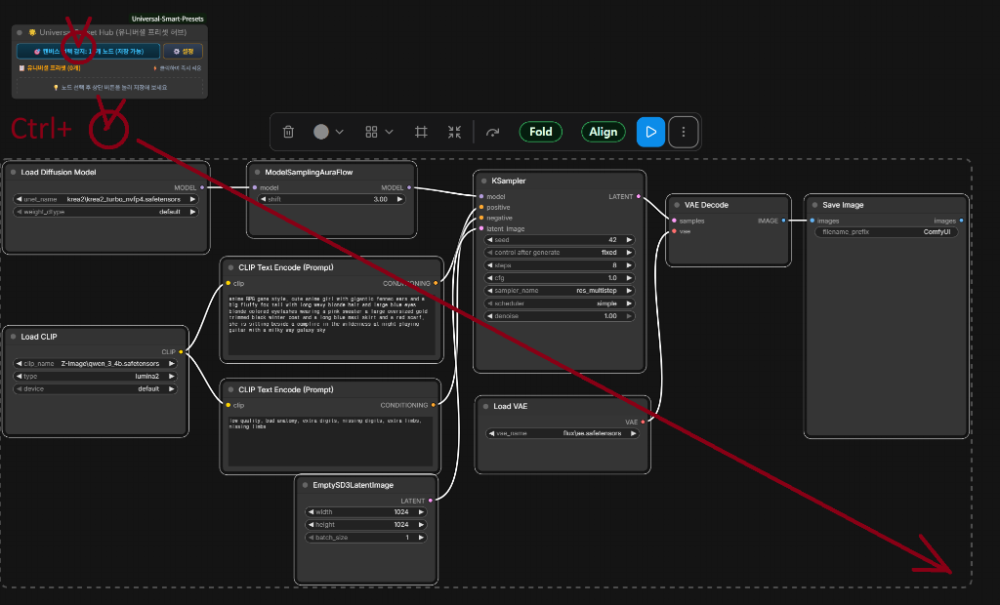
     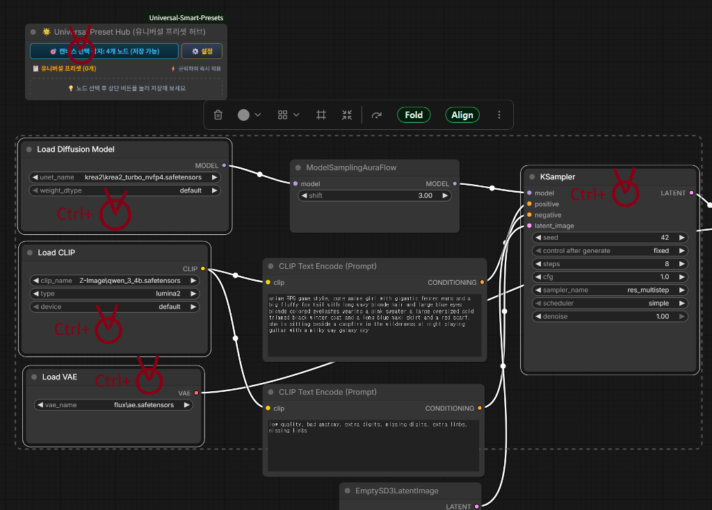
   </p>
3. **🟣 바이패스(Bypass) & 🔴 뮤트(Mute) 상태 완벽 지원**:
   * 고화질 업스케일러, 디테일러, 페이스 복원 서브네트워크의 활성/바이패스 분기 상태를 프리셋별로 자유자재로 구성하여 저장합니다.
4. **📋 유니버셜 프리셋 허브 관리자**:
   * 각 프리셋에 포함된 노드 요약 태그, 순서 변경(▲/▼), 이름 변경(✏️), 백업 추출/불러오기 지원.
   <p align="center">
     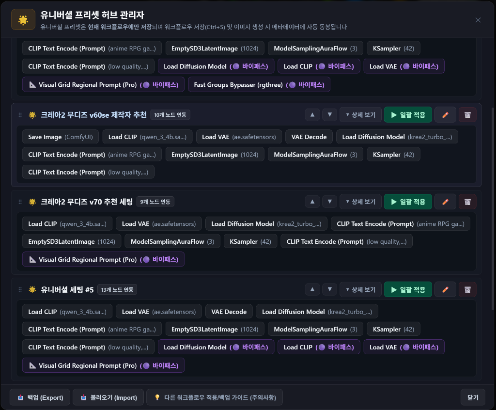
   </p>
5. **🏷️ 2-Tier 지붕 뱃지 (Roof Badges)**:
   * 캔버스의 모든 노드 상단에 `[🌐 N]`(글로벌 프리셋 개수) 및 `[🌟 N]`(유니버셜 연동 개수) 뱃지가 자동으로 마운트되어 원클릭 팝업을 지원합니다.
   <p align="center">
     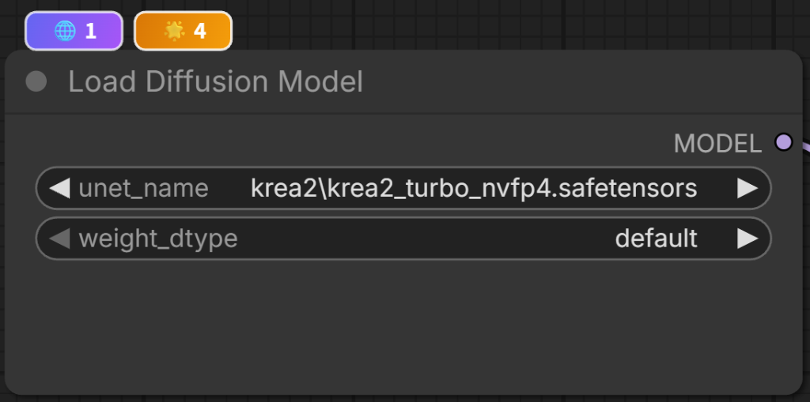
   </p>
6. **🌐 개별 노드 글로벌 프리셋 & 파라미터별 ON/OFF 알약 토글**:
   * 우클릭 메뉴를 통해 해당 노드 종류(KSampler 등) 전용 글로벌 프리셋을 관리합니다.
   * `seed`만 OFF(취소선)하여 **시드 번호는 유지한 채 steps, cfg, sampler만 주입**하는 정밀 제어를 지원합니다.
   <p align="center">
     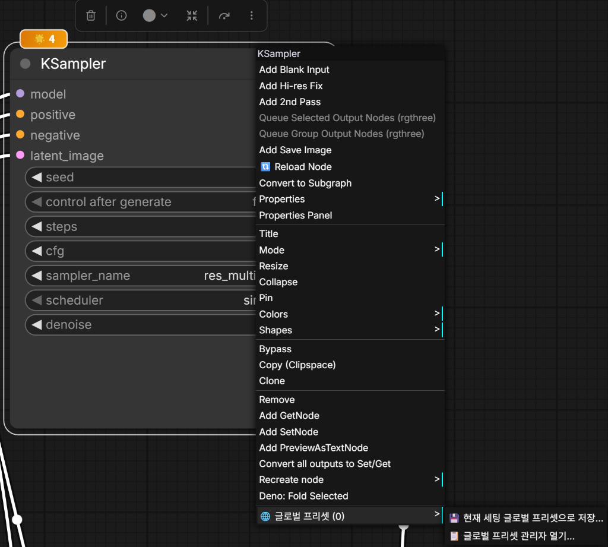
     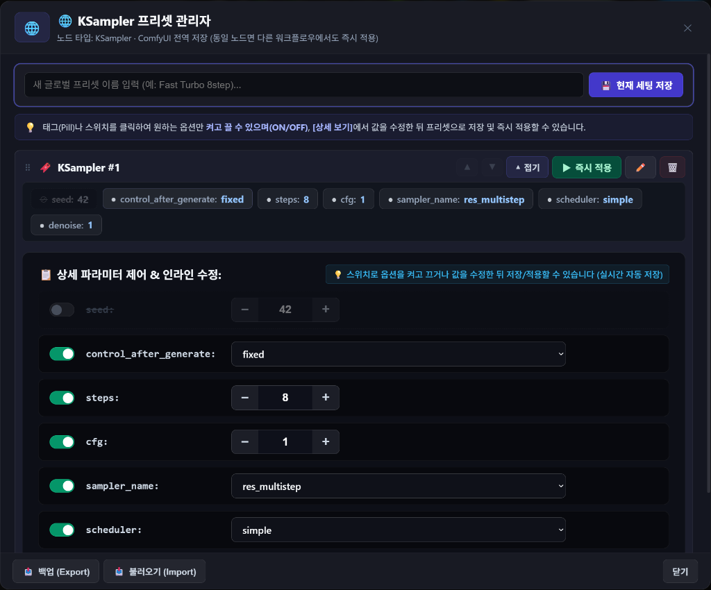
   </p>
7. **🧠 3단계 스마트 노드 매칭 엔진**:
   * `Tier 1 (Node ID)` ➔ `Tier 2 (Title + Type)` ➔ `Tier 3 (캔버스 X/Y 좌표 순차 배치)` 순으로 추적하여 타인의 워크플로우에서도 충돌 없이 100% 안전하게 값을 복원합니다.

---

### ⚡ Module 3. 자동 모델 & LoRA 어사이너 (`Auto Assigner`)
> **외부 워크플로우 로드 시 누락된 모델을 원클릭으로 감지하고 내 PC 로컬 모델로 스마트 자동 연결**

| 1. 캔버스 빈 곳 우클릭 (전체 모델 일괄 매칭) | 2. 전체 모델 일괄 스마트 매칭 창 |
| :---: | :---: |
| 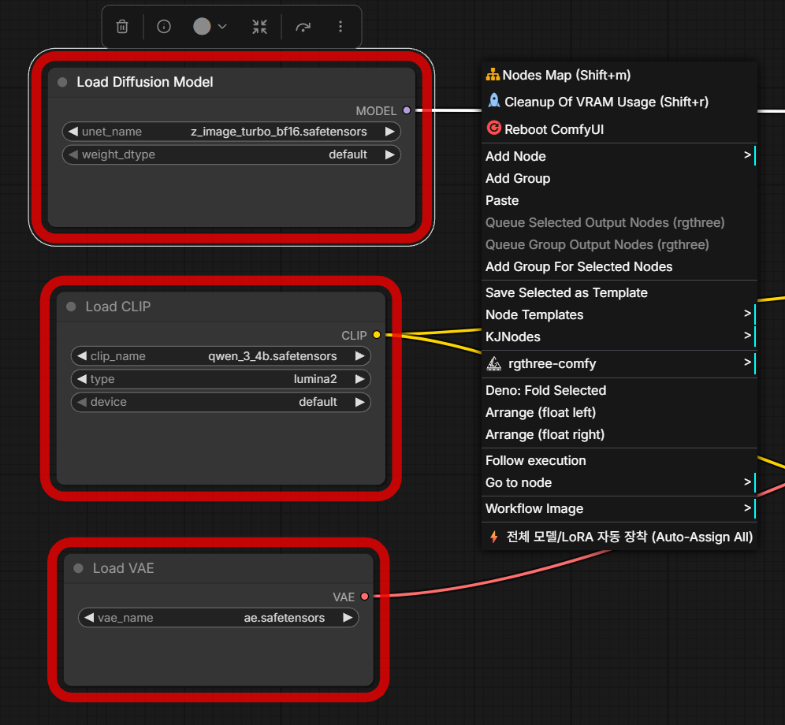 | 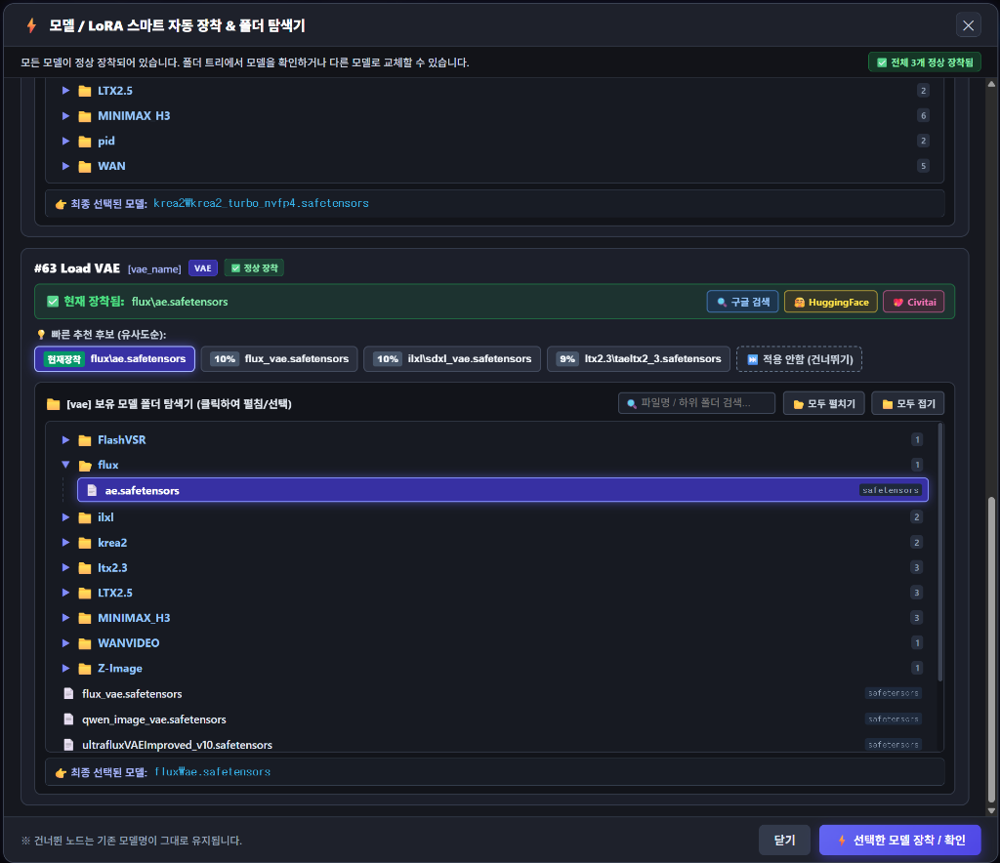 |
| *메뉴 최하단 `⚡ 전체 모델/LoRA 자동 장착` 클릭* | *모든 누락 노드를 감지하여 100% 매칭 및 유사도 순 추천 제공* |

| 3. 특정 노드 우클릭 (단일 노드 매칭) | 4. 해당 노드 단독 스마트 매칭 창 |
| :---: | :---: |
| 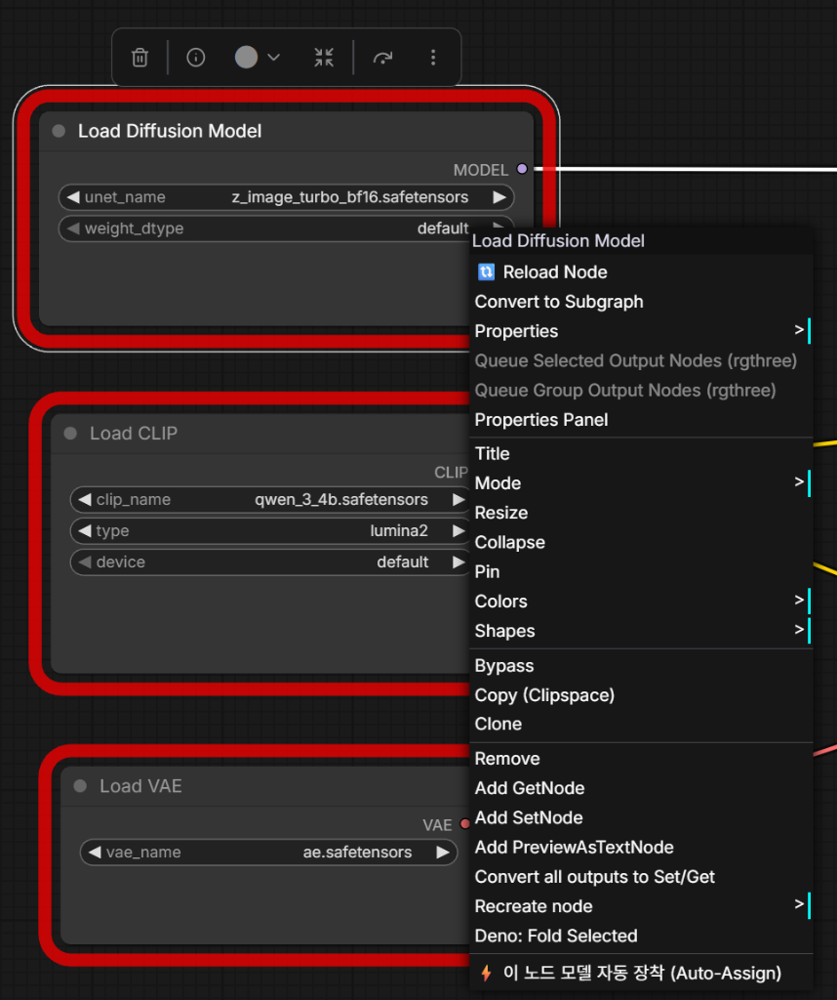 | 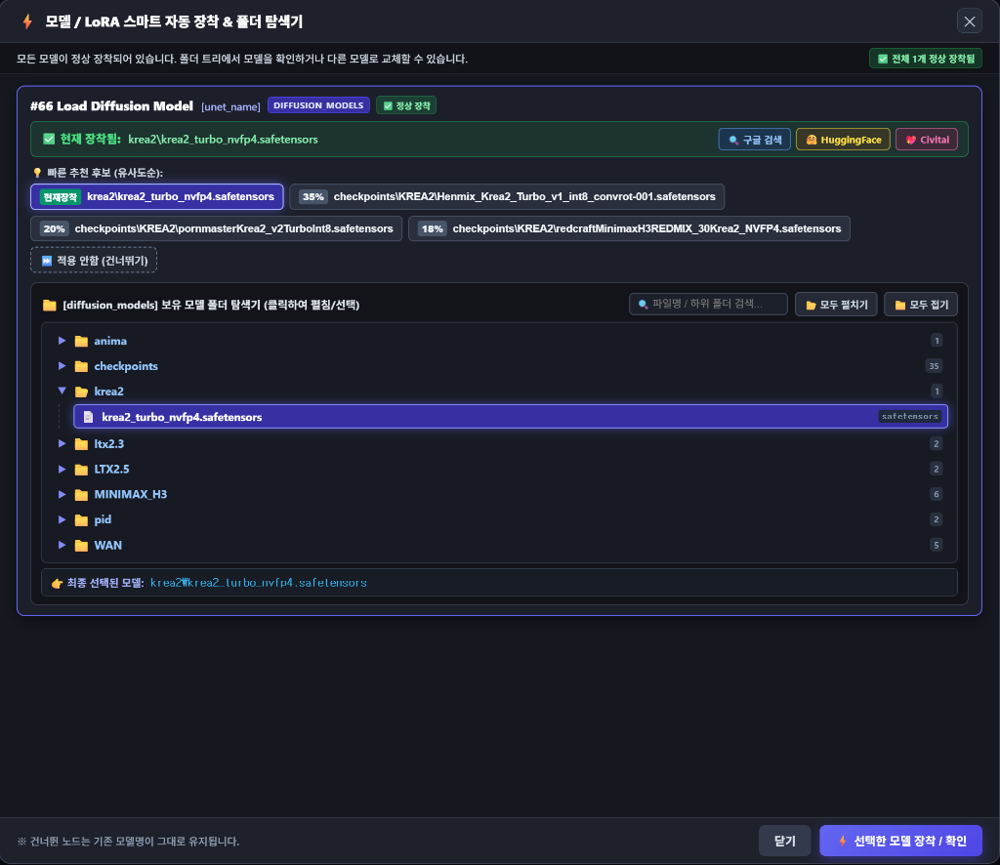 |
| *메뉴 최하단 `⚡ 이 노드 모델 자동 장착` 클릭* | *선택한 노드 1개만 단독으로 신속하게 매칭/교체* |

#### 🌟 핵심 특징
1. **🌲 윈도우 탐색기형 대형 폴더 트리**:
   * 모델 디렉토리의 하위 계층 구조를 시원하게 탐색할 수 있으며, 현재 장착된 파일이 있는 폴더를 자동으로 펼쳐 중앙에 하이라이트합니다.
2. **🧩 서드파티 멀티 모델 / LoRA 노드 완벽 지원 (Universal Slot Adapter)**:
   * `Power Lora Loader (rgthree)`, `DaSiWa LoRA Loader`, `Deno Multi LoRA Loader`, `Comfyroll`, `Efficiency Nodes` 등 객체형/배열형 멀티 모델 노드도 슬롯별로 개별 분리 감지합니다.
3. **🧠 지능형 퍼지 매칭 엔진**:
   * 정밀도(`fp8`, `bf16`, `fp16`), 버전(`v1`, `v2`, `turbo`), 특수문자를 정규화하여 내 PC에서 가장 적합한 모델을 유사도(%) 순으로 정렬 추천합니다.
4. **🌐 AI 모델 원클릭 스마트 웹 검색**:
   * 파일명의 군더더기를 정제하여 `🔍 구글 검색`, `🤗 HuggingFace`, `💖 Civitai` 원클릭 다운로드 페이지를 엽니다.
5. **🛡️ 빨간색 에러 테두리 자동 제거**:
   * 모델을 연결하는 즉시 노드 주변의 빨간 에러 테두리를 지우고 캔버스를 정상 리프레시합니다.

---

### ✨ Module 4. 편의성(QoL) 마스터 (`Workflows+` & Canvas Fixer)
> **사이드바 워크플로우 관리, 작업 중 실시간 추적, 빈 캔버스 시작 및 전역 마우스 보정**

#### 📊 순정 Workflows vs 강화된 Workflows+ 비교
| 구분 | 📋 순정 Workflows 탭 | ✨ 강화된 Workflows+ 탭 |
| :--- | :---: | :---: |
| **순정 환경 보존** | 100% 순정 상태 유지 | 원클릭 상단 탭 전환 (`Workflows` ↔ `Workflows+`) |
| **빈 폴더 표시 (`0`개)** | ❌ 워크플로우 없으면 숨겨짐 | ⭕ **회색 뱃지와 함께 온전히 표시 & 보존** |
| **마우스 드래그 앤 드롭** | ❌ 지원 안 됨 | ⭕ **마우스로 집어서 폴더 / Root로 자유롭게 이동** |
| **폴더 자동 펼침 (호버)** | ❌ 지원 안 됨 | ⭕ **1.2초간 머무르면 하위 폴더 자동 오픈** |
| **글자 & 행 크기 조절** | ❌ 변경 불가 | ⭕ **독립 4단계 조절 (`A⁻` ~ `A⁺⁺`) & 영구 기억** |
| **현재 작업 워크플로우 추적** | ❌ 수동 검색 필요 | ⭕ **🎯 실시간 자동 포커싱 & 스마트 자동 스크롤** |
| **즐겨찾기 (⭐/★)** | ⭕ 기본 제공 | ⭕ **순정 DB와 1:1 양방향 실시간 완벽 동기화** |
| **우클릭 관리 메뉴** | ❌ 기본 메뉴만 제공 | ⭕ **불러오기 / 폴더이동 / 즐겨찾기 / 이름변경 / 삭제** |

#### 📸 주요 화면 가이드
* **(1) ✨ Workflows+ 탐색기 & 🎛️ 상단 원터치 퀵 툴바**:
  <p align="center">
    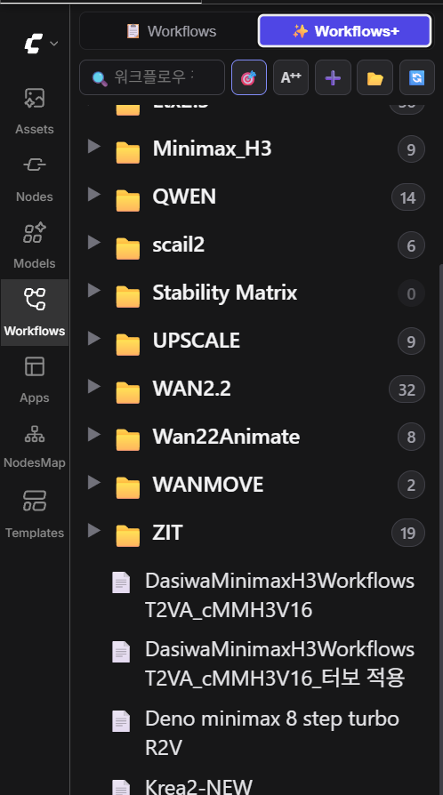
    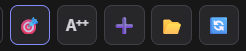
  </p>
  * 🎯 **작업 중 워크플로우 포커스**: 캔버스에 열려 있는 워크플로우의 위치로 스크롤을 즉시 이동하고 초록색 하이라이트로 반짝여 표시.
  * **`A⁺⁺` 글자/행 크기 조절**: 좌클릭 순환 변경 (`A⁻` ~ `A⁺⁺`), 우클릭 즉시 선택 메뉴.
  * ➕ **새 폴더 생성**, 📂 **모두 펼치기/접기**, 🔄 **새로고침**.

* **(2) 🖱️ 마우스 드래그 앤 드롭 폴더 이동**:
  <p align="center">
    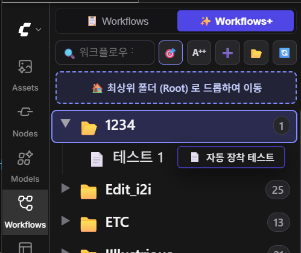
    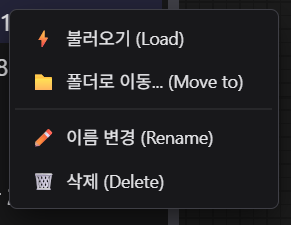
  </p>
  * 마우스 커서 고스트 배지와 함께 최상위 `🏠 Root` 박스 또는 하위 폴더로 드래그하여 이동.
  * 닫힌 폴더 위에 1.2초간 머무르면 폴더가 자동으로 열려 세부 경로로 쏙 넣을 수 있습니다.

* **(3) 🎯 작업 중 자동 포커싱 & 순정 DB 즐겨찾기 양방향 동기화**:
  <p align="center">
    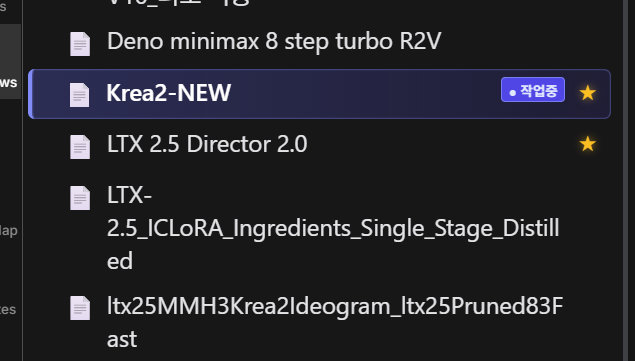
  </p>
  * 상단 탭 전환 시 작업 중인 파일에 파란색 `[• 작업중]` 배지가 붙으며 해당 위치로 스크롤 자동 보정.
  * 순정 SQLite DB(`comfyui.db`)와 즐겨찾기 상태가 100% 실시간 양방향 연동.

* **(4) 🧼 클린 빈 캔버스 시작 (`Clean Blank Startup`)**:
  * ComfyUI 기동 시 모델 누락 오류("2 errors found")를 방지하고 쾌적한 빈 캔버스로 시작합니다.

* **(5) 🖱️ 전역 마우스 화면 이동(Pan) & 휠 줌(Zoom) 보정**:
  * 텍스트 입력창이나 서드파티 노드 위에서도 마우스 휠 줌 및 중간 버튼 화면 이동이 멈추지 않고 매끄럽게 동작합니다.

---

## ⚙️ BADA 전역 통합 설정 (`⚙️ Settings -> 🌊 Bada Utils`)

ComfyUI 우측 상단 톱니바퀴(**`⚙️ Settings`**) 메뉴에서 **`🌊 Bada Utils`** 탭을 선택하여 모든 설정을 한눈에 관리할 수 있습니다:

<p align="center">
  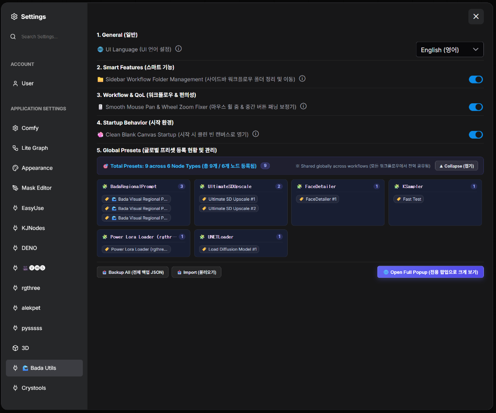
</p>

### 📋 5대 통합 설정 항목 상세

| 섹션 | 설정 항목 | 설명 |
| :--- | :--- | :--- |
| **1. General (일반)** | **🌐 UI Language (UI 언어 설정)** | `English (영어)` 및 `한국어 (Korean)` 실시간 전환. ComfyUI 순정 언어 설정과 완전 독립적으로 작동하여 안정적인 언어 환경을 유지합니다. |
| **2. Smart Features (스마트 기능)** | **📁 Sidebar Workflow Folder Management**<br>*(사이드바 워크플로우 폴더 정리 및 이동)* | 왼쪽 사이드바에서 드래그 앤 드롭 폴더 이동, 빈 폴더(0개) 보존, 실시간 작업 파일 포커싱을 지원하는 Workflows+ 기능을 제어합니다. |
| **3. Workflow & QoL (워크플로우 & 편의성)** | **🖱️ Smooth Mouse Pan & Wheel Zoom Fixer**<br>*(마우스 휠 줌 & 중간 버튼 패닝 보정기)* | 텍스트 입력창이나 서드파티 노드 위에서도 마우스 휠 줌 및 중간 버튼 패닝이 멈추지 않고 매끄럽게 동작하도록 보정합니다. |
| **4. Startup Behavior (시작 환경)** | **🧼 Clean Blank Canvas Startup**<br>*(시작 시 클린 빈 캔버스로 열기)* | ComfyUI 최초 실행 및 새 탭 오픈 시 기본 모델 누락 오류("2 errors found")를 방지하고 깨끗한 빈 캔버스로 기동하도록 설정합니다. |
| **5. Global Presets**<br>*(글로벌 프리셋 등록 현황 및 관리)* | **🗃️ 인라인 통합 프리셋 관리 패널** | 워크플로우 간 전역 공유되는 노드별 프리셋을 한눈에 파악할 수 있는 전체 폭 패널입니다. **접기/펼치기**, **전체 백업(JSON)**, **불러오기**, **전용 팝업으로 크게 보기**를 지원합니다. |

---

> [!NOTE]
> **💡 권장 ComfyUI 캔버스 모드**:  
> `rgthree-comfy` 등 고급 비주얼 캔버스 도구들과 마찬가지로, **클래식 캔버스 렌더링(Nodes 1.0)** 모드 사용을 강력 권장합니다.  
> ComfyUI 설정(`⚙️ -> Use New Nodes 2.0`)에서 실험적 **Nodes 2.0**이 켜져 있다면, 부드러운 격자 드래그와 온캔버스 라디오 버튼 사용을 위해 **OFF(비활성화)**로 설정해 주세요.

---

## 📂 기본 제공 예제 워크플로우

저장소의 [`workflows/visual_grid_prompt_workflow.json`](workflows/visual_grid_prompt_workflow.json) 파일을 ComfyUI 화면으로 **드래그 & 드롭**하시면 완성된 캐릭터 시트 리저널 프롬프트 워크플로우를 즉시 테스트하실 수 있습니다.

---

## 🚀 설치 방법 (Installation)

### 방법 1. 1-클릭 바로가기 설치 (Windows 권장)
저장소 루트의 **`install_junction.bat`** 파일을 더블 클릭하여 실행하면 ComfyUI의 `custom_nodes/` 폴더에 Junction 바로가기가 자동 생성됩니다.

### 방법 2. ComfyUI Manager
1. ComfyUI Manager를 엽니다.
2. `ComfyUI-Bada-Utils`를 검색한 후 **Install**을 클릭합니다.
3. ComfyUI를 재시작하고 브라우저에서 **`Ctrl + F5` (강력 새로고침)**을 누릅니다.

### 방법 3. Git Clone
```bash
cd ComfyUI/custom_nodes
git clone https://github.com/bada-ya/ComfyUI-Bada-Utils.git
```

---

## 🛡️ 100% 하위 호환성 보장 (Backward Compatibility)
기존에 개별 노드로 제작된 워크플로우(`UniversalPresetHub`, `VisualGridPromptNode`, `VisualGridPrompt`)는 **자동 클래스 별칭(Alias) 매핑**을 통해 빨간색 결손 노드 에러 없이 100% 완벽하게 로드되고 정상 작동합니다.

---

## 📄 라이선스 (License)
본 프로젝트는 **[MIT License](LICENSE)** 에 따라 오픈소스로 배포됩니다.
